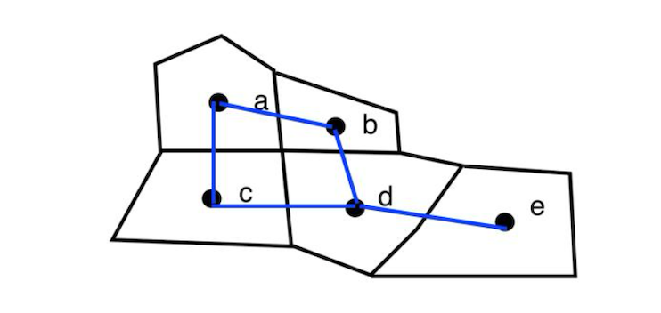

# 1 Overview

After selecting an appropriate spatial aggregation scale and performing an initial descriptive analysis using mapping tools, the next step in spatial analysis is to define the neighbourhood structure of the spatial units.

This step is essential for quantifying the spatial relationships between geographic features, that is, understanding **how each spatial unit is influenced by its neighbours**. Defining neighbourhoods allows analysts to measure spatial dependence, or the extent to which nearby observations exhibit similar or related values.

To formalize this, we use **spatial weights**, which **represent the intensity or presence of a spatial relationship** between features such as regions, points, or polygons. These weights form the foundation for a wide range of spatial analytical techniques, including the calculation of spatial autocorrelation indices, the application of spatial econometrics models, the analysis of spatial distributions, and methods such as spatial sampling or graph partitioning.

In this hands-on exercise, we will learn how to compute spatial weights using R:

-   import geospatial data using appropriate function(s) of **sf** package,
-   import csv file using appropriate function of **readr** package,
-   perform relational join using appropriate join function of **dplyr** package,
-   compute spatial weights using appropriate functions of **spdep** package, and
-   calculate spatially lagged variables using appropriate functions of **spdep** package.

# 2 The Data

Two data sets will be used in this hands-on exercise, they are:

-   Hunan county boundary layer. This is a geospatial data set in ESRI shapefile format.
-   *Hunan_2012.csv*: This csv file contains selected Hunan’s local development indicators in 2012.

# 3 Import Libraries

+-----------------------------------------------------------------+-----------------------------------------------------------------+
| Library                                                         | Desc                                                            |
+=================================================================+=================================================================+
| [sf](https://r-spatial.github.io/sf/)                           | handling geospatial data                                        |
+-----------------------------------------------------------------+-----------------------------------------------------------------+
| [tmap](https://cran.r-project.org/web/packages/tmap/index.html) | visualization for geospatial data                               |
+-----------------------------------------------------------------+-----------------------------------------------------------------+
| tidyverse                                                       | handling data including packages **readr**, **tidyr and dplyr** |
+-----------------------------------------------------------------+-----------------------------------------------------------------+
| knitr                                                           | generate elegant, flexible, and fast dynamic report             |
+-----------------------------------------------------------------+-----------------------------------------------------------------+
| [spdep](https://r-spatial.github.io/spdep/index.html)           | create spatial weights matrix objects from polygon contiguities |
+-----------------------------------------------------------------+-----------------------------------------------------------------+

```{r}
pacman::p_load(sf, tmap, tidyverse,knitr,spdep)
```

# 4 Import Data

## 4.1 Import Shape File

The code chunk below uses [*st_read()*](https://r-spatial.github.io/sf/reference/st_read.html) of **sf** package to import Hunan shapefile into R. The imported shapefile will be **simple features** Object of **sf**.

```{r}
hunan <- st_read(dsn="data/geospatial",
               layer = "Hunan")%>%
  st_transform(crs=4490)
  
```

```{r}
st_crs(hunan)
```

After importing the shape file, let's plot the graph:

```{r}
par(bg="#f6f6f6")
plot(hunan)
```

## 4.2 Import CSV File

Next, we will import *Hunan_2012.csv* into R by using *read_csv()* of **readr** package. The output is R dataframe class.

```{r}
hunan2012 <- read_csv("data/aspatial/Hunan_2012.csv")
      
```

```{r}
kable(head(hunan2012))
```

## 4.3 Perform Relational Join

The code chunk below will be used to update the attribute table of *hunan*’s SpatialPolygonsDataFrame with the attribute fields of *hunan2012* dataframe. This is performed by using *left_join()* of **dplyr** package.

After performing a left join, we remove unnecessary columns and retain only 'NAME_2', 'ID_3', 'NAME_3', 'ENGTYPE_3', 'County', and 'GDPPC' for further analysis.

```{r}
hunan <- left_join(hunan,hunan2012,
                   by = "County") 
kable(head(hunan,5))
class(hunan)
```

# 5 Visualize Regional Development Indicator

Now, we are going to prepare a basemap and a choropleth map showing the distribution of GDP Per Capita (GDPPC) 2012 by using **tmap** package:

```{r}
#| fig.width: 12
#| fig.height: 10
tm_shape(hunan) +
  tm_polygons(fill = "GDPPC") +
  tm_text("NAME_3", size=0.6)+
 tm_title("2012 Hunan GDP Per Capita",
           position = tm_pos_out("center", "top", "center")) +
  tm_credits("Changsha had the highest GDP per capita",
             position = c("center", "top"), size = 0.8, just = "center",
             bg.color = NA, fontface = "italic") +
  tm_layout(
    legend.position = c("left", "bottom"),
    bg.color = "#f6f6f6",
    frame = FALSE)
```

As shown in the graph above, Changsha had the highest GDP per capita in Hunan in 2012.

# 6 Compute Contiguity Spatial Weights

In this section, we will learn how to use [*poly2nb()*](https://r-spatial.github.io/spdep/reference/poly2nb.html) of **spdep** package to compute contiguity weight matrices for the study area. This function builds a neighbours list based on regions with contiguous boundaries, that is sharing one or more boundary point.

In `poly2nb()`, the “queen” argument of takes TRUE or FALSE as options. If you do not specify this argument the default is set to TRUE, that is, if you don’t specify queen = FALSE this function will return a list of first order neighbours using the Queen criteria.

## 6.1 Compute (QUEEN) contiguity based neighbors

A Queen contiguity weight matrix is a type of spatial weights matrix used in spatial analysis to define neighborhood relationships between spatial units (e.g., polygons like counties or districts).It's named after the **Queen’s move in chess**, where a queen can move in **all 8 directions** vertically, horizontally, and diagonally.

Queen contiguity **defines neighbors as polygons that share either an edge OR a vertex (corner).** So, even if two polygons only **touch at a point**, they are still considered **neighbors** under Queen contiguity!

The code chunk below is used to compute Queen contiguity weight matrix:

```{r}
wm_q <- poly2nb(hunan,queen=TRUE)
summary(wm_q)
```

::: callout-note
## How to read the result?

The summary report above shows that:

-   There are total 88 area units/conties in Hunan.
-   Across all units, there are 448 total neighbor connections, where one region is considered a neighbor of another.
-   Only around 5.8% (448 / (88\*88) ) of all possible region-to-region connections are considered neighbors
-   On average, each region has around 5 neighbors (448/88) under Queen contiguity.
-   The Link number distribution says 2 regions (Region 30 & 65) has only 1 neighbor, 2 regions has 2 neighbors,..,1 region (Region 85) has 11 neighbors
:::

For each polygon in our polygon object, *wm_q* lists all neighboring polygons. For example, to see the neighbors for the first polygon in the object:

```{r}
wm_q[[1]]
```

It means that **Polygon 1** has 5 neighbors. The numbers represent the polygon IDs as stored in hunan SpatialPolygonsDataFrame class.

We can retrive the county name of Polygon ID=1 by using the code chunk below:

```{r}
hunan$County[1]
```

The output reveals that Polygon ID=1 is Anxiang county.

To reveal the county names of the five neighboring polygons, the code chunk will be used:

```{r}
hunan$County[c(2,3,4,57,85)]
```

We can retrieve the GDPPC of these five countries by using the code chunk below:

```{r}
nb1 <- wm_q[[1]]
nb1 <- hunan$GDPPC[nb1]
nb1
```

The printed output above shows that the GDPPC of the five nearest neighbours based on Queen’s method are 20981, 34592, 24473, 21311 and 22879 respectively.

We can also display the complete weight matrix by using `str()`:

```{r}
str(wm_q)
```

## 6.2 Compute (ROOK) contiguity based neighbors

Unlike Queen contiguity, Rook contiguity defines neighbors more restrictively. It only **considers units as neighbors if they** **share a common edge (border)**, not just a corner. This is similar to how a rook moves in chess: only horizontally or vertically, not diagonally.

The code chunk below is used to compute Rook contiguity weight matrix:

```{r}
wm_r <- poly2nb(hunan, queen=FALSE)
summary(wm_r)
```

::: callout-note
## How to read the result?

The summary report above shows that:

-   There are total 88 area units/conties in Hunan.
-   Across all units, there are 440 total neighbor connections, where one region is considered a neighbor of another.
-   Only around 5.8% (440 / (88\*88) ) of all possible region-to-region connections are considered neighbors
-   On average, each region has around 5 neighbors (440/88) under ROOK contiguity.
-   The Link number distribution says 2 regions (Region 30 & 65) has only 1 neighbor, 2 regions has 2 neighbors,..,1 region (Region 85) has 10 neighbors
:::

## 6.3 Comparison between Queen & Rook Contiguity

Queen finds more neighbors overall because it includes shared corners (vertices) in addition to shared edges. Rook is more restrictive, including only shared edges, so some "corner-only" neighbors from Queen are excluded here:

-   Only **8 total links** were dropped in the Rook version.
-   **Region 85** (the most connected) dropped from 11 to 10 neighbors.
-   This suggests that Hunan counties are mostly **connected by edges**, not just corners, so the choice between Rook and Queen may not drastically change the results.

## 6.4 Visualize Contiguity Weights

A connectivity graph **takes a point and displays a line** to each neighboring point. The most typically method to turn a polygon into a point is to use **its centroids (the geometric center of the shape)**. We will calculate these in the sf package before moving onto the graphs.

{width="423"}

### 6.4.1 Getting Latitude and Longitude of Polygon Centroids

It will be a little more complicated than just running `st_centroid()` on the sf object, since it returns **geometry objects**, not just plain coordinate numbers (X,Y). To build a data frame of X (longitude) and Y (latitude) values, we need to extract those numbers out of the geometry.

To do this we will use a mapping function `map_dbl()` of purrr package. The mapping function applies a given function to each element of a vector/list and returns a vector/list of the same length:

-   The input vector will be the geometry column of `us.bound`.
-   The function will be `st_centroid()`

#### 6.4.1.1 Extract X (longitude)

The code below means for each polygon in `us.bound$geometry`:

-   Get the centroid: `st_centroid(.x)`
-   Extract the **first coordinate** (longitude) using `[[1]]` , since longitude is the first value in each centroid

```{r}
longitude <- map_dbl(hunan$geometry, ~st_centroid(.x)[[1]])
```

#### 6.4.1.1 Extract Y (latitude)

```{r}
latitude <- map_dbl(hunan$geometry, ~st_centroid(.x)[[2]])
```

#### 6.4.1.2 Combine X & Y

Now that we have latitude and longitude, we use cbind to put longitude and latitude into the same object:

```{r}
coords <- cbind(longitude, latitude)
```

```{r}
kable(head(coords,5))
```

## 6.5 Plot Queen Contiguity Based Neighbours Map

```{r}
#| fig.width: 12
#| fig.height: 10
par(bg="#f6f6f6")
plot(hunan$geometry, border="grey")
plot(wm_q, coords, pch = 19, cex = 0.6, add = TRUE, col= "red")
```

## 6.6 Plot Rook Contiguity Based Neighbours Map

```{r}
#| fig.width: 12
#| fig.height: 10
par(bg="#f6f6f6")
plot(hunan$geometry, border="grey")
plot(wm_q, coords, pch = 19, cex = 0.6, add = TRUE, col= "blue", lty = 2)
```

## 6.7 Overlay Both Queen and Rook Contiguity on a Single Map

```{r}
#| fig.width: 12
#| fig.height: 10

par(bg = "#f6f6f6")
plot(hunan$geometry, border = "grey", main = "Queen and Rook Contiguity")
plot(wm_q, coords, add = TRUE, col = "red", lwd = 1)
plot(wm_r, coords, add = TRUE, col = "blue", lwd = 1, lty = 2)
points(coords, pch = 19, cex = 0.5)
legend("topright",
       legend = c("Queen", "Rook"),
       col = c("red", "blue"),
       lty = c(1, 2), #line types 1=solid (Queen), 2=dashed (Rook)
       lwd = 1, 
       bty = "n") # border type: no border
```

# 7 Compute Distance Based Neighbours

In this section, we will learn how to derive distance-based weight matrices by using [*dnearneigh()*](https://r-spatial.github.io/spdep/reference/dnearneigh.html) of **spdep** package.

The function defines neighbors based on **distance**, not on shared borders (like Queen or Rook). The function identifies neighbours of region points by **Euclidean distance** with a distance band with lower d1= and upper d2= bounds controlled by the **bounds=** argument.

The key arguments

+------------------+-------------------------------------------------------------------------------------------------------------------------------------------------------------------------------------------------------------------------------------+
| Argument         | Description                                                                                                                                                                                                                         |
+==================+=====================================================================================================================================================================================================================================+
| `x`              | A matrix of coordinates (usually centroids) or an `sf`/`Spatial` object                                                                                                                                                             |
+------------------+-------------------------------------------------------------------------------------------------------------------------------------------------------------------------------------------------------------------------------------+
| `d1`             | Minimum distance (lower bound): neighbors closer than this will be ignored                                                                                                                                                          |
+------------------+-------------------------------------------------------------------------------------------------------------------------------------------------------------------------------------------------------------------------------------+
| `d2`             | Maximum distance (upper bound): neighbors farther than this will be ignored                                                                                                                                                         |
+------------------+-------------------------------------------------------------------------------------------------------------------------------------------------------------------------------------------------------------------------------------+
| `bounds`         | Controls how strictly the distances are interpreted (open or closed interval)                                                                                                                                                       |
+------------------+-------------------------------------------------------------------------------------------------------------------------------------------------------------------------------------------------------------------------------------+
| `longlat = TRUE` | If unprojected coordinates are used and either specified in the coordinates object x or with x as a two column matrix and longlat=TRUE, great circle distances in **km** will be calculated assuming the WGS84 reference ellipsoid. |
|                  |                                                                                                                                                                                                                                     |
|                  | **Only needed for longitude/latitude data (EPSG:4326 WGS84)**                                                                                                                                                                       |
+------------------+-------------------------------------------------------------------------------------------------------------------------------------------------------------------------------------------------------------------------------------+

## 7.1 Determine the cut-off distance

Firstly, we need to determine the upper limit for distance band by using the steps below:

-   Return a matrix with the indices of points belonging to the set of the k nearest neighbours of each other by using [*knearneigh()*](https://r-spatial.github.io/spdep/reference/knearneigh.html) of **spdep**.
-   Convert the knn object returned by *knearneigh()* into a neighbours list of class nb with a list of integer vectors containing neighbour region number ids by using [*knn2nb()*](https://r-spatial.github.io/spdep/reference/knn2nb.html).
-   Return the length of neighbour relationship edges by using [*nbdists()*](https://r-spatial.github.io/spdep/reference/nbdists.html) of **spdep**. The function returns in the units of the coordinates if the coordinates are projected, in km otherwise.
-   Remove the list structure of the returned object by using [**unlist()**](https://www.rdocumentation.org/packages/base/versions/3.6.2/topics/unlist).

```{r}
k1 <- knn2nb(knearneigh(coords))
k1dists <- unlist(nbdists(k1, coords, longlat = TRUE))
summary(k1dists)
```

The summary report shows that the largest first nearest neighbour distance is 61.79 km, so using this as the **upper threshold** gives certainty that all units will have at least one neighbour.

## 7.2 Compute fixed distance weight matrix

Now, we will compute the distance weight matrix by using *dnearneigh()* as shown in the code chunk below:

```{r}
wm_d62 <- dnearneigh(coords, 0, 62, longlat = TRUE)
wm_d62
```

::: callout-note
## How to read the result?

The summary above shows that:

-   There are 88 counties in Hunan
-   There are 324 neighbor relationships where counties are within 62km of each other (Each link connects two counties bidirectionally)
-   Only 4.18% (324/88\*88) of all possible county pairs are neighbors
-   Each county has an average of 3.68 (324/88) neighbors within 62km
:::

Next, we use *str()* to display the content of wm_d62 weight matrix:

```{r}
str(wm_d62)
```

Another way to display the structure of the weight matrix is to combine [*table()*](https://www.rdocumentation.org/packages/base/versions/3.6.2/topics/table) and [*card()*](https://r-spatial.github.io/spdep/reference/card.html) of spdep.

It means that Anhua has one neighbor & Anren has 4 neighbours:

```{r}
table(hunan$County, card(wm_d62))
```

Next we use the code below check the **connected components:**

-   **`n.comp.nb()`**: Analyzes the connectivity structure of the neighbor list
-   **`n_comp$nc`**: Returns the number of connected components
    -   If `n_comp$nc = 1`: All 88 counties form one connected network, meaning we can reach any county from any other county through neighbor links. This is ideal for most spatial analysis
    -   If `n_comp$nc > 1`: Hunan are split into separate groups with some counties or comp isolated from others. This can be problematic for spatial autocorrelation analysis.

```{r}
n_comp <- n.comp.nb(wm_d62)
n_comp$nc
```

```{r}
table(n_comp$comp.id)
```

The results above show Hunan itself is one connected component.

## 7.3 Plot Fixed Distance Weight matrix

```{r}
#| fig.width: 12
#| fig.height: 10
par(bg="#f6f6f6")
plot(hunan$geometry,border = "grey")
plot(wm_d62,coords,add=TRUE)
plot(k1, coords, add=TRUE, col="red", length=0.08)
```

The red lines show the links of 1st nearest neighbours and the black lines show the links of neighbours within the cut-off distance of 62km.

Alternatively, we can plot both of them next to each other by using the code chunk below:

```{r}
#| fig.width: 12
#| fig.height: 10
par(bg="#f6f6f6",mfrow=c(1,2))
plot(hunan$geometry, border="grey", main="1st nearest neighbours")
plot(k1, coords, add=TRUE, col="red", length=0.08)
plot(hunan$geometry, border="grey", main="Distance link")
plot(wm_d62, coords, add=TRUE, pch = 19, cex = 0.6)
```

## 7.4 Compute adaptive distance weight matrix

One of the characteristics of fixed distance weight matrix is that more densely settled areas (usually the urban areas) tend to have more neighbours and the less densely settled areas (usually the rural counties) tend to have lesser neighbours.

Having many neighbours smoothes the neighbour relationship across more neighbours:

-   Urban areas: Strong smoothing effect (many neighbors influence each other)

-   Rural areas: Less smoothing (few neighbors, more isolated effects)

    -\> This creates **uneven spatial smoothing** across the study area.

It is possible to control the numbers of neighbours directly using k-nearest neighbours, either accepting asymmetric neighbours or imposing symmetry as shown in the code chunk below.

```{r}
# find the 6 nearest neighbors for each county
knn6 <- knn2nb(knearneigh(coords, k=6))
knn6
```

Similarly, we can display the content of the matrix by using *str()*:

```{r}
str(knn6)
```

Notice that each county has six neighbours. If our goal is to study the GDPPC comparative analysis, k-nearest neighbors ensure the equal spatial smoothing between dense areas (urban) and sparse areas (rural).

## 7.5 Plot Adaptive Distance Weight matrix

```{r}
#| fig.width: 12
#| fig.height: 10
par(bg="#f6f6f6")
plot(hunan$geometry, border="grey")
plot(knn6, coords, pch = 19, cex = 0.6, add = TRUE, col = "red")
```

# 8 Compute Weights Based on IDW

In this section, we will learn how to derive a spatial weight matrix based on Inversed Distance method (weight = 1/distance to neighbor).

First, we will compute the distances between areas by using [*nbdists()*](https://r-spatial.github.io/spdep/reference/nbdists.html) of **spdep**:

It computes the **distances between neighboring regions/points**, given:

-   `nb` → a **neighbors list** object (usually from `poly2nb()` or `knn2nb()`).
-   `coords` → the coordinates of your points or centroids.
-   `longlat = TRUE` → TRUE if point coordinates are longitude-latitude decimal degrees, in which case distances are measured in **kilometers**; NULL if coords is a SpatialPoints object, the value is taken from the object itself

```{r}
dist <- nbdists(wm_q, coords, longlat = TRUE)
ids <- lapply(dist, function(x) 1/(x))
ids
```

::: callout-note
## How to read the result?

-   Each `[[n]]` corresponds to **one point** in the dataset. \[\[1\]\] means point 1

-   The vector inside `[[n]]` contains **inverse-distance weights** to its neighbors.

    **For example:**

    -   Observation 1 has **5 neighbors**.
    -   The weight of neighbor 1 = 0.01535405, neighbor 2 = 0.03916350, etc.
    -   These weights are calculated as **1 / distance**. So closer neighbors have bigger numbers.

    ``` r
    [[1]]
    [1] 0.01535405 0.03916350 0.01820896 0.02807922 0.01145113
    ```
:::

# 9 Row-standardised Weights Matrix

Next, we need to assign weights to each neighboring polygon. By doing this, we can **measure “influence” of neighboring regions.**

In our case, each neighboring polygon will be assigned **equal weight** (**style=“W”**). This is accomplished by assigning the fraction: **1/n** to each neighboring county then summing the weighted income values. While the method is simple and intuitive, the drawback is that boundary regions have fewer neighbors, so their lagged values might be biased, thus potentially over- or under-estimating the true nature of the spatial autocorrelation in the data

Other robust method includes **Binary weights (`style="B"`)** - Each neighbor just gets **1**, non-neighbors get **0**.

```{r}
rswm_q <- nb2listw(wm_q, style="W", zero.policy = TRUE)
rswm_q
```

The zero.policy=TRUE option allows for lists of **non-neighbors**. R will **allow observations with no neighbors**, treating them as having **weights = 0**. If FALSE(the default), R will throw an **error** if any observation has no neighbors.

::: callout-note
## How to read the result?

-   n: Number of observations (regions/polygons). Here, 88 regions/polygons.
-   nn: Total number of neighbor pairs. Together, these polygons have **7744 neighbor connections**.
-   S0: Sum of all weights in the matrix. The weights are **row-standardized (`W`)**, so each row sums to 1 → `S0 = 88`
-   S1: Sum of **squared weights**
-   S2: Sum of **squared sums of weights per row**
    -   S1 and S2 are internal numbers used for calculating variance and significance in Moran’s I or Geary’s C.
:::

To see the weight of the first polygon’s five neighbors type:

```{r}
rswm_q$weights[[1]]
```

Each neighbor is assigned a 0.125 of the total weight. This means that when R computes the average neighboring income values, each neighbor’s income will be multiplied by 0.125 before being tallied.

Using the same method, we can also derive a row standardised distance weight matrix by using the code chunk below.

```{r}
rswm_ids <- nb2listw(wm_q,glist=ids,style = "B", zero.policy = TRUE)
rswm_ids
```

```{r}
rswm_ids$weights[[1]]
```

Next, we summarize all the neighbor weights across all polygons:

```{r}
summary(unlist(rswm_ids$weights))
```

# 10 Application of Spatial Weight Matrix

In this section, we will learn how to create four different spatial lagged variables, they are:

-   spatial lag with row-standardized weights,
-   spatial lag as a sum of neighbouring values,
-   spatial window average, and
-   spatial window sum.

A **spatial lag** is a concept in spatial analysis that captures the **influence of neighboring locations on a given location**. For example, the price of one house depends on prices of neighboring houses. The spatial lag is called a **“lag”** because it captures **influence from surrounding locations**, similar to how a time lag captures influence from previous times.

## 10.1 Spatial lag with row-standardized weights

Finally, we’ll use `lag.listw()` to compute the average neighbor GDPPC value for each polygon. These values are often referred to as **spatially lagged values**:

```{r}
# GDPPC.lag is a numeric vector with the same length as hunan$GDPPC
GDPPC.lag <- lag.listw(rswm_q,hunan$GDPPC)
GDPPC.lag
```

The code below display the weighted average (according to `rswm_q`) of County 1’s neighbors’ GDPPC

```{r}
GDPPC.lag[1]
```

Recalled in the previous section, we retrieved the GDPPC of these five neighbors by using the code chunk below:

```{r}
# country 1
nb1 <- wm_q[[1]]
nb1 <- hunan$GDPPC[nb1]
nb1
```

Next, we calculate the average GDPPC of the 5 neighbors, which gives the same result as `GDPPC.lag[1]`:

```{r}
mean(nb1)
```

We can append the spatially lag GDPPC values onto hunan sf data frame by using the code chunk below.

```{r}
# bundle two vectors: county names and lagged GDPPC values into a list
lag.list <- list(hunan$NAME_3, lag.listw(rswm_q, hunan$GDPPC)) 
# turn the list into a data frame with two columns
lag.res <- as.data.frame(lag.list)
# rename the columns
colnames(lag.res) <- c("NAME_3", "lag GDPPC")
# join the lagged GDPPC values back into the hunan dataset by county name
hunan <- left_join(hunan,lag.res)
```

```{r}
lag.res
```

The following table shows the average neighboring income values (stored in the Inc.lag object) for each county.

```{r}
kable(head(hunan,5))
```

Next, we will plot both the GDPPC and spatial lag GDPPC for comparison using the code chunk below.

```{r}
#| fig.width: 12
#| fig.height: 10
gdppc <- tm_shape(hunan) +
  tm_polygons(fill = "GDPPC") +
  tm_text("NAME_3", size=0.6)+
 tm_title("GDPPC",
           position = tm_pos_out("center", "top", "center")) +
  tm_layout(
    legend.position = c("left", "bottom"),
    bg.color = "#f6f6f6",
    frame = FALSE)


lag_gdppc <- tm_shape(hunan) +
  tm_polygons(fill = "lag GDPPC") +
  tm_text("NAME_3", size=0.6)+
 tm_title("Lag GDPPC",
           position = tm_pos_out("center", "top", "center")) +
  tm_layout(
    legend.position = c("left", "bottom"),
    bg.color = "#f6f6f6",
    frame = FALSE)
tmap_arrange(gdppc, lag_gdppc, asp=1, ncol=2)
```

The right map shows the average GDPPC of each county’s neighbors. Pingjiang appears as the darkest region, indicating that its surrounding counties (including Changsha, Liuyang, Miluo, and the Yueyang area) are relatively wealthy, resulting in a higher weighted average GDP per capita for the region.

## 10.2 Spatial lag as a sum of neighboring values

We can calculate spatial lag as a sum of neighboring values by assigning binary weights. This requires us to go back to our neighbors list, then apply a function that will assign binary weights( **Binary weights (`style="B"`)** - Each neighbor just gets **1**, non-neighbors get **0**.), then we use glist = in the nb2listw function to explicitly assign these weights.

We start by applying a function that will assign a value of 1 per each neighbor. This is done with lapply, which we have been using to manipulate the neighbors structure throughout the past notebooks. Basically it applies a function across each value in the neighbors structure.

```{r}

b_weights <- lapply(wm_q, function(x) 0*x + 1) 

b_weights2 <- nb2listw(wm_q, 
                       glist = b_weights, #Each neighbor gets weight = 1
                       style = "B") # Same result: 
                                    # neighbors get 1, non-neighbors get 0
b_weights2
```

With the proper weights assigned, we can use lag.listw to compute a lag variable from our weight and GDPPC.

```{r}
lag_sum <- list(hunan$NAME_3, lag.listw(b_weights2, hunan$GDPPC))
lag.res <- as.data.frame(lag_sum)
colnames(lag.res) <- c("NAME_3", "lag_sum GDPPC")
```

First, let us examine the result by using the code chunk below.

```{r}
lag_sum
```

The counties add up the GDPPC of their neighbors:

```{r}
lag.res
```

Next, we will append the *lag_sum GDPPC* field into `hunan` sf data frame by using the code chunk below.

```{r}
hunan <- left_join(hunan, lag.res)
```

```{r}
kable(head(hunan,5))
```

Now, We can plot both the *GDPPC* and *Spatial Lag Sum GDPPC* for comparison using the code chunk below.

```{r}
#| fig.width: 12
#| fig.height: 10
lag_sum_gdppc <- tm_shape(hunan) +
  tm_polygons(fill = "lag_sum GDPPC") +
  tm_text("NAME_3", size=0.6)+
 tm_title("Lag sum GDPPC",
           position = tm_pos_out("center", "top", "center")) +
  tm_layout(
    legend.position = c("left", "bottom"),
    bg.color = "#f6f6f6",
    frame = FALSE)
tmap_arrange(gdppc, lag_sum_gdppc, asp=1, ncol=2)
```

The binary approach considers both 'quantity' and 'quality' - the number of neighbors determines how many values are summed, while the economic characteristics of those neighbors determine the magnitude of each contribution. Counties with more neighbors have the potential for higher GDPPC values, but the actual wealth levels of those neighbors also influences the final result.

For example, county 85 with 11 neighbors and counties 83 and 86 with 9 neighbors each show that Taoyuan, Guiyang, and Xiangtan have both numerous neighbors and relatively wealthy surrounding areas.

```{r}
print(which(card(wm_q) == 11))
print(which(card(wm_q) == 9))
print(hunan$County[c(85, 83, 86)])
```

## 10.3 Spatial Window Average

The spatial window average uses row-standardized weights and includes the diagonal element. To do this in R, we need to go back to the neighbors structure and add the diagonal element before assigning weights.

To add the diagonal element to the neighbour list, we just need to use *include.self()* from **spdep**.

```{r}
wm_qs <- include.self(wm_q)
wm_qs
```

Notice that the Number of nonzero links, Percentage nonzero weights and Average number of links are 536, 6.921488 and 6.090909 respectively as compared to wm_q of 448, 5.785124 and 5.090909. The number of nonzero link increased by 88 (536-448).

Let us take a good look at the neighbour list of area \[1\] by using the code chunk below.

```{r}
wm_qs[[1]]
```

Notice that now \[1\] has six neighbours instead of five.

Now we obtain weights with *nb2listw():*

```{r}
wm_qs <- nb2listw(wm_qs)
wm_qs
```

Again, we use *nb2listw()* and *glist()* to explicitly assign weight values.

Lastly, we just need to create the lag variable from our weight structure and GDPPC variable.

```{r}
lag_w_avg_gpdpc <- lag.listw(wm_qs, 
                             hunan$GDPPC)
lag_w_avg_gpdpc
```

Next, we will convert the lag variable listw object into a data.frame by using *as.data.frame()*.

```{r}
lag.list.wm_qs <- list(hunan$NAME_3, lag.listw(wm_qs, hunan$GDPPC))
lag_wm_qs.res <- as.data.frame(lag.list.wm_qs)
colnames(lag_wm_qs.res) <- c("NAME_3", "lag_window_avg GDPPC")
hunan <- left_join(hunan, lag_wm_qs.res)
```

To compare the values of lag GDPPC and Spatial window average, `kable()` of Knitr package is used to prepare a table using the code chunk below:

```{r}
hunan %>%
  select("County", 
         "lag GDPPC", 
         "lag_window_avg GDPPC") %>%
  kable()
```

Now, We can plot both the lag_gdppc and w_ave_gdppc for comparison using the code chunk below:

```{r}
#| fig.width: 12
#| fig.height: 10

w_avg_gdppc <- tm_shape(hunan) +
  tm_polygons(fill = "lag_window_avg GDPPC") +
  tm_text("NAME_3", size=0.6)+
 tm_title("Lag Window Avg GDPPC",
           position = tm_pos_out("center", "top", "center")) +
  tm_layout(
    legend.position = c("left", "bottom"),
    bg.color = "#f6f6f6",
    frame = FALSE)
tmap_arrange(lag_gdppc, w_avg_gdppc, asp=1, ncol=2)
```

The window average method smooth out / generalize the value. The graph indicates that the east side of Hunan is more developed compared to the west side.

## 10.4 Spatial Window Sum

The spatial window sum is the counter part of the window average, but without using row-standardized weights.

To add the diagonal element to the neighbour list, we just need to use *include.self()* from **spdep**.

```{r}
wm_qs <- include.self(wm_q)
wm_qs
```

Next, we will assign binary weights to the neighbour structure that includes the diagonal element.

```{r}
b_weights <- lapply(wm_qs, function(x) 0*x + 1)
b_weights[1]
```

Notice that now \[1\] has six neighbours instead of five.

Again, we use *nb2listw()* and *glist()* to explicitly assign weight values.

```{r}
b_weights2 <- nb2listw(wm_qs, 
                       glist = b_weights, 
                       style = "B")
b_weights2
```

With our new weight structure, we can compute the lag variable with *lag.listw()*.

```{r}
w_sum_gdppc <- list(hunan$NAME_3, lag.listw(b_weights2, hunan$GDPPC))
w_sum_gdppc
```

Next, we will convert the lag variable listw object into a data.frame by using *as.data.frame()*, and append it to the hunan sf dataset:

```{r}
w_sum_gdppc.res <- as.data.frame(w_sum_gdppc)
colnames(w_sum_gdppc.res) <- c("NAME_3", "w_sum GDPPC")
hunan <- left_join(hunan, w_sum_gdppc.res)
```

To compare the values of lag GDPPC and Spatial window average, `kable()` of Knitr package is used to prepare a table using the code chunk below.

```{r}
hunan %>%
  select("County", "lag_sum GDPPC", "w_sum GDPPC") %>%
  kable()
```

Lastly, plot the lag_sum GDPPC and w_sum_gdppc maps next to each other for quick comparison.

```{r}
#| fig.width: 12
#| fig.height: 10

w_sum_gdppc <- tm_shape(hunan) +
  tm_polygons(fill = "w_sum GDPPC") +
  tm_text("NAME_3", size=0.6)+
 tm_title("Window Sum GDPPC",
           position = tm_pos_out("center", "top", "center")) +
  tm_layout(
    legend.position = c("left", "bottom"),
    bg.color = "#f6f6f6",
    frame = FALSE)
tmap_arrange(lag_sum_gdppc, w_sum_gdppc, asp=1, ncol=2)
```

One of the scenario of Spatial Window Sum is open new stores. The assumption is the neighborhoods are highly likely to be the potential customers.

## 11 Reference

-   Kam, T.S. (2025). [Spatial Weights and Applications](https://r4gdsa.netlify.app/chap08.html#references)
