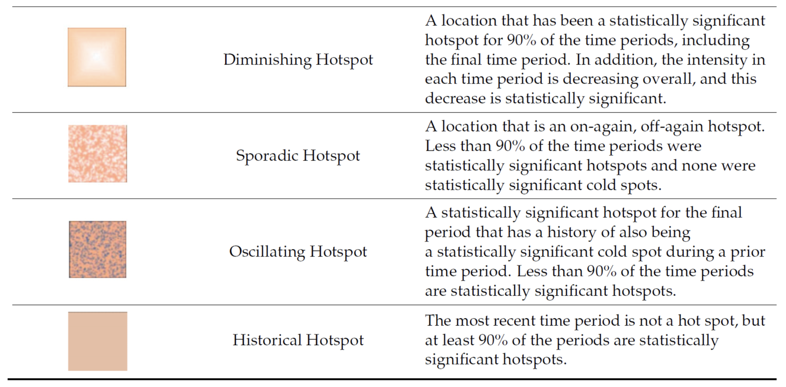
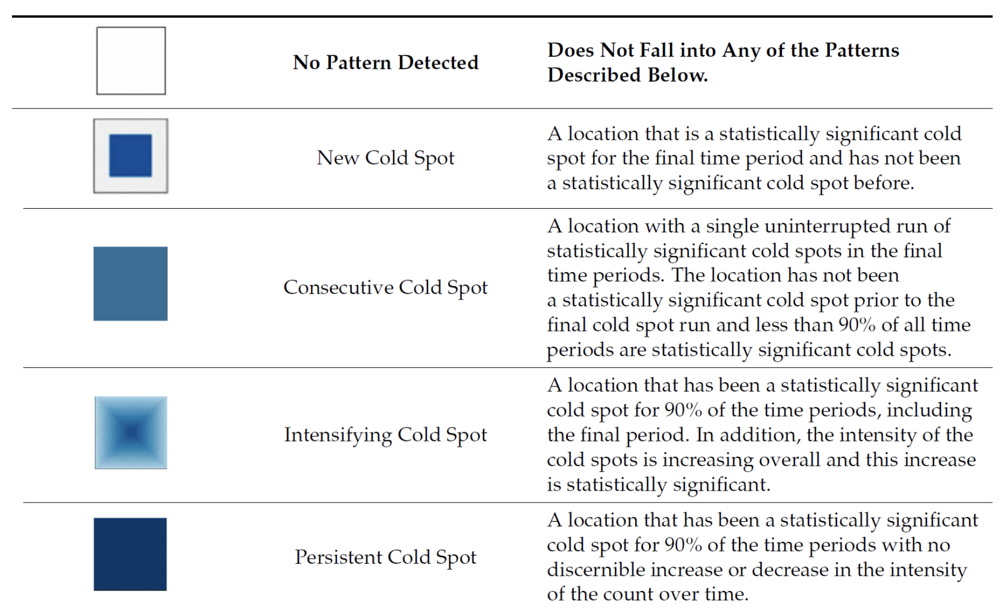
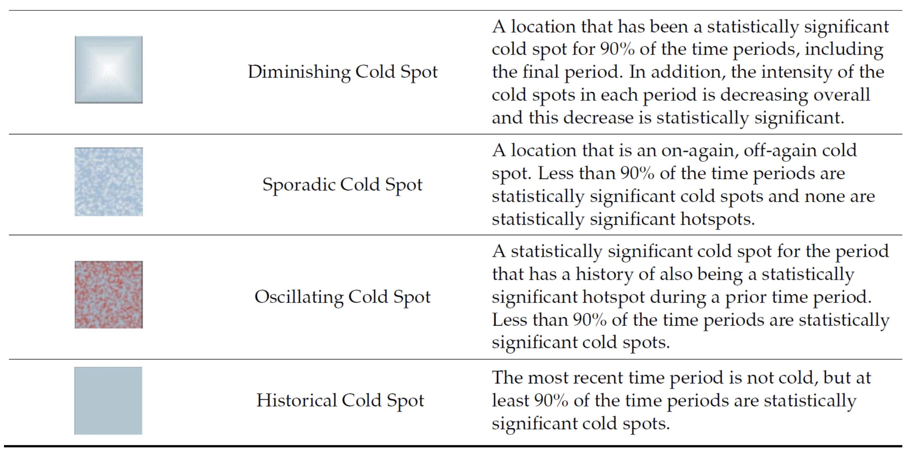

# 1 Overview

Emerging Hot Spot Analysis (EHSA) is a spatio-temporal analysis method for revealing and describing how hot spot and cold spot areas evolve over time. The analysis consist of four main steps:

-   Building a space-time cube,
-   Calculating Getis-Ord local Gi\* statistic for each bin by using an FDR correction,
-   Evaluating these hot and cold spot trends by using Mann-Kendall trend test,
-   Categorising each study area location by referring to the resultant trend z-score and p-value for each location with data, and with the hot spot z-score and p-value for each bin.
-   EHSA classifies locations into patterns based on:
    1.  **Statistical significance** (hot spot, cold spot, not significant)

    2.  **Trend over time** (increasing, decreasing, stable)

    3.  **Consistency** (persistent, sporadic, oscillating)

## 1.1 Comparison

| **Analysis** | **Spatial** | **Temporal** | **Output** |
|----------------|----------------|------------|-----------------------|
| **Gi**\* | V | X | Hot/cold spots at one time |
| **Local Moran's I** | V | X | Clusters + outliers at one time |
| **EHSA** | V | V | Hot/cold spot trends over time |

# 2 Getting Started

## 2.1 Load R packages

```{r}
pacman::p_load(sf, sfdep, tmap, plotly, tidyverse, Kendall, patchwork,knitr)
```

## 2.2 The Data

For the purpose of this in-class exercise, the Hunan data sets will be used. There are two data sets in this use case, they are:

-   Hunan, a geospatial data set in ESRI shapefile format, and
-   Hunan_GDPPC, an attribute data set in csv format.

Before getting started, reveal the content of *Hunan_GDPPC.csv* by using Notepad and MS Excel.

### 2.2.1 Import shapefile

The code chunk below uses [`st_read()`](https://r-spatial.github.io/sf/reference/st_read.html) of **sf** package to import Hunan shapefile into R. The imported shapefile will be **simple features** Object of **sf**.

```{r}
hunan <- st_read(dsn = "data/geospatial", 
                 layer = "Hunan") %>%
   st_transform(crs = 32650)
```

```{r}
st_crs(hunan)
```

After importing the shape file, let's plot the graph:

```{r}
par(bg="#f6f6f6")
plot(hunan)
```

### 2.2.2 Import CSV File

Next, we will import *Hunan_2012.csv* into R by using *read_csv()* of **readr** package. The output is R dataframe class.

```{r}
GDPPC <- read_csv("data/aspatial/Hunan_GDPPC.csv")
      
```

```{r}
kable(head(GDPPC))
```

### 2.2.3 Create a Time Series Cube

In the code chunk below, [`spacetime()`](https://sfdep.josiahparry.com/reference/spacetime.html) of sfdep ised used to create an spatio-temporal cube:

```{r}
GDPPC_st <- spacetime(GDPPC,hunan,
                      .loc_col = "County",
                      .time_col = "Year")
GDPPC_st
```

```{r}
is_spacetime_cube(GDPPC_st)
```

# 3 Compute Gi\*

Next, we will compute the local Gi\* statistics.

## 3.1 Deriving the spatial weights

The code chunk below will be used to derive an inverse distance weights. Closer neighbors (Weight = 1/distance) have higher influences.

-   `activate()` of dplyr package is used to activate the geometry component of the spatial data, telling R to work with the spatial features (polygons/points)
-   `mutate()` of dplyr package is used to create two new columns *nb* and *wt*.
-   Then we will activate the data context again and copy over the nb and wt columns to each time-slice using `set_nbs()` and `set_wts()`
    -   **row order is very important so do not rearrange the observations after using `set_nbs()` or `set_wts()`**

```{r}
GDPPC_nb <- GDPPC_st %>%
  activate("geometry") %>% 
  mutate(
    # includes focal value for Gi* calculation
    # Finds neighbors based on shared boundaries(queen method)
    nb = include_self(st_contiguity(geometry,queen=TRUE)), 
    # inverve distance weights
    #weight = scale / (distance ^ alpha)
    wt = st_inverse_distance(nb, geometry, scale = 1, alpha = 1) 
  ) %>%
  set_nbs("nb") %>%
  set_wts("wt")
```

Now we can observe the table include variables for year, county, neighbors (include itself) and weights assigned to its neighbors.

```{r}
kable(head(GDPPC_nb))
```

Next, we calculate the Gi\* for each location per year using `local_gstar_perm()` for the Gi\* calculation permutation test. The result of `local_gstar_perm()` is presented in a list-column format, contaning columns for Gi\*,cluster, e_gi, var_gi, std_dev... Hence, we then use `tidyr::unnest()` to transform the nested list result into seperate columns:

-   `gi`: the observed statistic
-   `e_gi`: the permutation sample mean
-   `var_gi`: the permutation sample variance
-   `p_value`: the p-value using sample mean and standard deviation
-   `p_sim`: the simulated p-value from the permutation test. The raw p-value from comparing your observed statistic to the permutation distribution
-   `p_folded_sim`: p-value based on the implementation of Pysal which always assumes a two-sided test taking the minimum possible p-value
-   `skewness`: sample skewness
-   `kurtosis`: sample kurtosis

```{r}
set.seed(1234)

gi_stars <- GDPPC_nb %>%
  group_by(Year) %>%
  mutate(gi_star = local_gstar_perm(GDPPC, nb, wt,
                                    nsim=999, #default
                                    alternative = "two.sided" )) %>% #default
  tidyr::unnest(gi_star) %>%
  mutate(
    classification = case_when(
      p_folded_sim <= 0.05 & cluster == "High" ~ "High GDP Cluster",
      p_folded_sim <= 0.05 & cluster == "Low" ~ "Low GDP Cluster",
      TRUE ~ "Not Significant"
    )
  )

```

Let's check the result:

```{r}
kable(head(gi_stars))
```

# 4 Mann-Kendall Test

A **monotonic series** or function is one that only increases (or decreases) and never changes direction. So long as the function either stays flat or continues to increase, it is monotonic.

-   H0: No monotonic trend
-   H1: Monotonic trend is present

In Emerging Hot Spot Analysis, Mann-Kendall tests whether a location's Gi\* values are **trending over time**:

-   Increasing trend → Intensifying hot/cold spot
-   Decreasing trend → Diminishing hot/cold spot
-   No trend but significant → Persistent hot/cold spot

**Interpretation**

-   Reject the null-hypothesis null if the p-value is smaller than the alpha value (i.e. 1-confident level)

-   Tau ranges between -1 and 1 where:

    -   -1 is a perfectly decreasing series, and

    -   1 is a perfectly increasing series.

## 4.1 Mann-Kendall Test on Gi

With these Gi\* measures we can then evaluate each location for a trend using the Mann-Kendall test. The code chunk run MK tests on all counties:

```{r}
mk_results <- gi_stars %>%
  group_by(County) %>%  # Replace with your county ID variable
  summarise(
    mk_tau = MannKendall(gi_star)$tau,
    mk_pvalue = MannKendall(gi_star)$sl,
    trend_direction = case_when(
      mk_pvalue > 0.05 ~ "No significant trend",
      mk_tau > 0 ~ "Increasing trend",
      mk_tau < 0 ~ "Decreasing trend"
    )
  )
```

We take Changsha for example:

```{r}
cbg <- gi_stars %>% 
  ungroup() %>% 
  filter(County == "Changsha") %>% 
  select(County, Year, gi_star)
```

```{r}
c <- ggplot(data = cbg, 
       aes(x = Year, 
           y = gi_star)) +
  geom_line() +
  theme_light()+
  theme(panel.background = element_rect(fill = "#f6f6f6"),
        plot.background = element_rect(fill = "#f6f6f6",color = NA),
        panel.grid = element_blank())
ggplotly(c)
```

```{r}
changsha_mk <- mk_results %>%
  filter (County == "Changsha")
changsha_mk
```

::: callout-note
This pattern suggests that Changsha experienced increasing spatial concentration (becoming more of a hot spot relative to its neighbors) through most of the time period, but this trend may have reversed or weakened recently.
:::

We can also sort to show significant emerging hot/cold spots by abs tau

```{r}
emerging_top10 <- mk_results %>% 
  arrange(mk_pvalue, abs(mk_tau)) %>% 
  slice(1:10)

kable(emerging_top10)
```

## 4.2 Performing Emerging Hotspot Analysis

Lastly, we will perform EHSA analysis by using [`emerging_hotspot_analysis()`](https://sfdep.josiahparry.com/reference/emerging_hotspot_analysis.html) of sfdep package. It takes a spacetime object x (i.e. GDPPC_st), and the quoted name of the variable of interest (i.e. GDPPC) for .var argument. The k argument is used to specify the number of time lags which is set to 1 by default. Lastly, nsim map numbers of simulation to be performed.

```{r}
set.seed(1234)

ehsa <- emerging_hotspot_analysis(
  x = GDPPC_nb, 
  include_gi = TRUE,
  .var = "GDPPC", 
  k = 1,      # time lag = 1
  nsim = 199, # 200 simulation
  nb_col = "nb",    
  wt_col = "wt",
  threshold = 0.05
)
```

```{r}
ehsa
```

```{r}
ggplot(data = ehsa,
       aes(x = classification)) +
  geom_bar(fill = "#93A4CC", color = "grey30")+
  theme_minimal()+
  theme(panel.background = element_rect(fill = "#f6f6f6"),
        plot.background = element_rect(fill = "#f6f6f6",color = NA),
        panel.grid = element_blank())
```

## 4.5 Visualize EHSA

Before we can do so, we need to join both *hunan* and *ehsa* together by using the code chunk below.

```{r}
hunan_ehsa <- hunan %>%
  left_join(ehsa,
            by = join_by(County == location))
```

Next, tmap functions will be used to plot a categorical choropleth map by using the code chunk below.

```{r}
#| fig.width: 12
#| fig.height: 10
ehsa_sig <- hunan_ehsa  %>%
  filter(p_value < 0.05)
tmap_mode("plot")
tm_shape(hunan_ehsa) +
  tm_polygons() +
  tm_borders(fill_alpha = 0.5) +
tm_shape(ehsa_sig) +
  tm_fill("classification") + 
  tm_text("NAME_3", size=0.6)+
  tm_borders(fill_alpha = 0.4)+
  tm_title("Emerging Hotspot Analysis",
           position = tm_pos_out("center", "top", "center"))+
  tm_layout(
    bg.color = "#f6f6f6",
    frame = FALSE)
```

```{r}
#| fig.width: 12
#| fig.height: 8
selected_locations <- c("Liuyang", "Changsha", "Pingjiang", "Shimen", "Hengdong")

plot_list <- list()

for (i in selected_locations) {
  
  # data for current county
  plot_data <- gi_stars %>% 
    ungroup() %>% 
    filter(County == i) %>% 
    select(County, Year, gi_star, p_folded_sim, classification)
  
  # classification from EHSA results
  classification_ehsa <- ehsa %>%
    filter(location == i) %>%
    pull(classification) %>%
    unique()
  
  plot_list[[i]] <- ggplot(data = plot_data, aes(x = Year, y = gi_star, color = classification)) +
    geom_hline(yintercept = c(-1.96, 1.96), 
               linetype = "dashed", 
               color = "gray50", 
               alpha = 0.7) +
    geom_hline(yintercept = 0, color = "black", linewidth = 0.3) +
    geom_line(linewidth = 0.5, color = "gray30") +
    geom_point(size = 2) +
    annotate("text", x = min(plot_data$Year), y = 2.2, 
             label = " z = 1.96, p<0.05)", 
             hjust = 0, size = 3, color = "gray40") +
    annotate("text", x = min(plot_data$Year), y = -2.2, 
             label = "z = -1.96, p<0.05", 
             hjust = 0, size = 3, color = "gray40") +
    # classification from Gi*
    scale_color_manual(values = c("High GDP Cluster" = "#d7191c", 
                                   "Low GDP Cluster" = "#2c7bb6",
                                   "Not Significant" = "gray60")) +
    theme_light() +
    labs(title = paste0(i, ": ", tools::toTitleCase(classification_ehsa)),
         color = "Classification") +
    theme(panel.background = element_rect(fill = "#f6f6f6"),
          plot.background = element_rect(fill = "#f6f6f6", color = NA),
          panel.grid = element_blank(),
          legend.position = "top",
          legend.background = element_rect(fill = "#f6f6f6"),
          plot.title = element_text(hjust = 0.5))
}

(plot_list[["Changsha"]] + plot_list[["Liuyang"]] + plot_list[["Pingjiang"]]) / 
  (plot_list[["Shimen"]] + plot_list[["Hengdong"]])
```

EHSA

```{r}
selected_locations <- c("Liuyang", "Changsha", "Pingjiang", "Shimen", "Hengdong")

filtered_data <- ehsa_sig  %>%
  filter(NAME_3 %in% selected_locations)%>%
  select(NAME_3, classification, tau, p_value)

kable(filtered_data)
```

Gi\* trend

```{r}

gi_trend <- mk_results %>%
  filter(County %in% selected_locations)


kable(gi_trend)
```

Gi\* details

```{r}
gi_details <- gi_stars %>%
  filter(County %in% selected_locations)


kable(gi_details)
```

## 4.6 Interpretation of EHSA classes

In Emerging Hotspot Analysis (EHAS), the study area for each location includes **both the location itself AND its neighbors**.

### 4.6.1 Hot Spot

](images/clipboard-573108312.png)

### 4.6.2 Cold Spot





# 5 Reference

-   Leary, H. (2023): [R Tutorial: Hotspot Analysis using Getis Ord Gi](https://rpubs.com/heatherleeleary/hotspot_getisOrd_tut)
