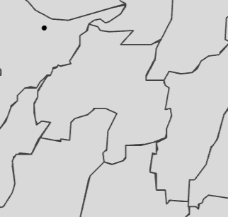

# 1 Overview

Market area analysis (also known as Trade Area Analysis) is the process of defining and studying the geographical area from which a business draws its customers. It involves analyzing data on consumer demographics, spending habits, and competitors to understand market viability, identify opportunities, and inform decisions about location, marketing, and expansion. It often combines empirical observation, like customer spotting, with mathematical models to identify market segments and understand customer behavior.

Huff model is a geospatial analysis method commonly used in market area analysis to predict the probability that a consumer from a specific area will patronize a particular store, based on the store’s attractiveness and distance relative to competitors. It calculates a store’s market share by considering factors like size or sales for attractiveness and distance or travel time, with the probability decreasing as distance or competition increases. This tool helps businesses assess potential revenue, define trade areas, and make informed decisions about site selection

## 1.1 Learning outcome

In this hands-on exercise, we will gain hands-on experience on how to perform market area analysis by using Huff model of [**MCI**](https://cran.r-project.org/web/packages/MCI/) packages.

By the end of this hands-on exercise, we will be able:

-   to import GIS data into R and save them as simple feature data frame by using appropriate functions of sf package of R;
-   to import aspatial data into R and save them as simple feature data frame by using appropriate functions of sf package of R;
-   to clean and tidy the data sets so that they are ready for the analysis,
-   to compute distance matrix between the origins (i.e. villages) and destinations (i.e stores),
-   to computer interaction probability using Huff model, and
-   to visualise the market area by using tmap and ggplot2 packages.

## 1.2 Setting the scene

A fast-food franchise is a business model in which an individual (the franchisee) acquires the rights to operate a restaurant under an established brand owned by a franchisor. This arrangement typically involves franchise fees and adherence to standardized operational procedures. Key considerations prior to investment include the scale of initial capital outlay, the strength of the brand, and the strategic importance of store location. Capital investment requirements vary significantly, generally ranging from approximately \$200,000 to more than \$2 million. Major global fast-food franchise brands include McDonald’s, Burger King, Pizza Hut, KFC, and Taco Bell.

In this exercise, you will assume the role of a data analyst within the business development team of a fast-food franchise. Your objective is to delineate the trade areas of existing stores in Taichung City and to produce corresponding spatial maps to support market analysis and strategic decision-making.

## 1.3 The Data

Four data sets will be used in this hands-on exercise, they are:

-   Geospatial data

    -   STORES_TN, store locations data in ESRI shapefile format.
    -   VILLAGE_TN, village boundary data in ESRI shapefile format.

-   Aspatial data

    -   pop2019.csv, population data of Taichung City in 2019. H_CNT, P_CNT, M_CNT, and F_CNT indicate Number of household, Total population, Male population and Female population respectively.

    -   Store_sales_data.csv provides store sales data

        ::: callout-note
        In reality, we should also consider the foot traffic and other characteristics of the store's surroundings to better estimate the store's attractiveness, rather than relying solely on store size
        :::

# 2 Getting Started

## 2.1 Importing Packages

Before we getting started, it is important for us to install the necessary R packages and launch them into RStudio environment.

The R packages need for this exercise are as follows:

-   sf for handling geospatial data and performing geoprocessing function such as computing distance matrix,
-   MCI for performing Huff and MCI modelling,
-   tidyverse for performing data science tasks including visualisation,
-   ggstatsplot, an R package that extends the ggplot2 visualization package to combine data visualization with statistical analysis, creating plots that include statistical test results directly, and
-   tmap for plotting cartographic quality thematic maps.

The code chunk below installs and launches these R packages into RStudio environment.

```{r}
pacman::p_load(sf, tidyverse, MCI, tmap, ggstatsplot,knitr)
```

## 2.2 Importing geospatial data

First, `st_read()` of sf package will be used to import the three geospatial data sets into R environment by using the code chunk below:

```{r}
stores <- st_read(
  dsn = "data/geospatial",
  layer = "STORES_TC")

town <- st_read(
  dsn = "data/geospatial",
  layer = "TOWN_TC")

village <- st_read(
  dsn = "data/geospatial",
  layer = "VILLAGE_TC")
```

The output print above shown that the three data sets are in **TWD97 / TM2 zone 121 (i.e epsg: 3826)** projected coordinates systems and the coordinates are in meters.

Let's check the data first:

```{r}
kable(head(stores))
kable(head(town))
kable(head(village))
```

Here we use interactive mode to get better understanding to our study area

```{r}
tmap_mode("view")

tm_shape(town) +
  tm_polygons() +
tm_shape(village) +
  tm_polygons() + 
tm_shape(stores) +
  tm_dots()+
  tm_title("Store Distribution in Taichung",
         position = tm_pos_out("center", "top", "center"))

tmap_mode("plot")

```

## 2.3 Importing aspatial data

Next, `read_csv()` of **readr** package will be used to import the two aspatial data sets into R environment.

```{r}
pop2019 <- read_csv("data/aspatial/pop2019.csv")

store_sales <- read_csv("data/aspatial/Store_sales_data.csv")
```

```{r}
kable(head(pop2019))
kable(head(store_sales))
```

```{r}
kable(summary(store_sales))
```

# 3 Data Preperation

## 3.1 Aggregating store sales

Code chunk below is used to aggregate the store sales data at Store Code.

```{r}
store_sales_aggre <- store_sales %>%
  group_by(`Store Code`) %>%
  summarise(
    "Total_Bill" = sum(Bills, na.rm = TRUE), #skip NA and keep suumming the value
    "Total_Sales" = sum(Amount, na.rm = TRUE))
```

## 3.2 Relational join

In the code chunk below, `left_join()` of **dplyr** package is used to append data from store_sales data.frame onto stores sf data.frame. At the same time a new field called *Store_size* has been created.

```{r}
stores <- stores %>%
  left_join(store_sales_aggre,
            by = join_by(
              Store_CD == `Store Code`)) %>%
  mutate(Store_size = 100) # Assume the store size is identical across all locations
```

Next, `summary()` is used to check if the are any missing values in the data.frame.

```{r}
summary(stores)
```

The store size will be used as the parameter for the attractiveness calculation.

## 3.3 Tidying pop2019 data.frame

We are planning to append data in pop2019 data.frame onto village sf data.frame. Before we can do so, it is wise to check in to values in the join field are the same.

```{r}
glimpse(pop2019)
glimpse(village)
```

Notice that the village ID (i.e. V_ID) in pop2019 data.frame is not in the same structure as the village code in village sf data.frame

Code chunk below will be used to remove the “-” sign from the values:

```{r}
pop2019 <- pop2019 %>%
  mutate(V_ID = str_remove_all(
    V_ID, "-"))
```

Now, we are ready to append data in pop2019 data.frame onto village sf data.frame by using `left_join()` of **dplyr** package.

```{r}
village <- village %>%
  left_join(pop2019,
            by = join_by(
              VILLCODE == V_ID))
```

## 3.4 **Check for missing or zero values**

It's important to check for missing values in the data to avoid errors in further analysis. Here we use summary to check NAs:

```{r}
summary(village)
```

The output print above revealed that the are five missing values in H_CNT, P_CNT, M_CNT and F_CNT fields.

Hence, code chunk below is used to remove the five records with missing values from village sf data.frame

```{r}
village <- village %>%
  filter(!is.na(P_CNT)) 
```

```{r}
any(is.na(village))
```

The missing values are all removed.

# 4 Computing Distance Matrix

Instead of calculate the distance between the villages and stores, we will calculate the centroid of each village using the code chunk below. Then, compute the distance between the centroids of the villages and the stores.

```{r}
village_center <- st_point_on_surface(village)
distmat <- st_distance(village_center, stores) 
```

::: callout-warning
## Why we don't use st_centroid() here?

Because some villages' boundary is quite tricky, if we use `st_centroid()` the center point may go out of the village, hence we use `st_point_on_surface()` instead.


:::

Next, the code chunk below is used to convert the distance matrix into long data.frame format

```{r}
rownames(distmat) <- village$`VILLCODE`
colnames(distmat) <- stores$`Store_CD`

distmat_long <- distmat %>%
  as.data.frame() %>%
  rownames_to_column(var = "VILLCODE") %>%
  pivot_longer(
    cols = -VILLCODE,
    names_to = "Store_CD",
    values_to = "distance"
  ) 
```

```{r}
kable(head(distmat_long))
```

Notice the distance has "\[m\]" to indicate the distances are in meters, but we need to remove it for analysis:

```{r}
rownames(distmat) <- village$`VILLCODE`
colnames(distmat) <- stores$`Store_CD`

distmat_long <- distmat_long %>%
  mutate(distance = as.numeric(distance)) # the matrix has m value
```

```{r}
kable(head(distmat_long))
```

Now, the "m" values are removed.

# 5 Preparing Interaction Matrix

Code chunk below will be used to build the interaction matrix required by MCI package.

```{r}
interaction_matrix <- distmat_long %>%
  left_join(
    stores %>% 
      st_drop_geometry() %>% 
      select(Store_CD, Store_size),
    by = "Store_CD") %>%
  relocate(
    distance, .after = last_col())
```

```{r}
summary(interaction_matrix)
```

# 6 Computing Huff model

```{r}
huff_share <- huff.shares(
  interaction_matrix, "VILLCODE", "Store_CD", 
  "Store_size", "distance")
```

## 6.1 Trade area analysis for a single store

First, let us select market share data of a store by usign *Store_CD* field (i.e. TG).

```{r}
market_share <- huff_share %>%
  filter(Store_CD == "TG")
```

Next, trade areas of the selected will be derived by using the code chun below.

```{r}
Trade_area <- village %>%
  left_join(market_share)
```

Before plotting the trade area map, code chunk below is used to extract the selected store from stores sf data.frame.

```{r}
selected_store <- stores %>%
  filter(Store_CD == "TG")
```

Now, use the code chunk below to plot the trade areas of the selected store.

we can also slice it in percentage based on domain knowledge like 20%, 30% .... to 90%

```{r}
tm_shape(Trade_area) +
  tm_polygons(
    fill = "p_ij",
    fill.scale = tm_scale_intervals(
      style = "fixed",          
      breaks = seq(0.1, 0.9, by = 0.1),  # 10% to 90%
      values = "brewer.blues"
    ),
    fill.legend = tm_legend(title = "Patronage Probability")
  ) +
  tm_shape(selected_store) +
    tm_dots(size = 0.3,
            fill = "red",
            col = "black") +
  tm_title("Distribution of Patronage Probability of Store TG by village") +
  tm_layout(frame = TRUE) +
  tm_borders(fill_alpha = 0.5) +
  tm_compass(type="8star", size = 2) +
  tm_scalebar() +
  tm_grid(alpha =0.2)
  
```

The patronage probability of the northern Taichung is higher than other region, less competitors.

For store BT:

```{r}
market_share <- huff_share %>%
  filter(Store_CD == "BT")

Trade_area <- village %>%
  left_join(market_share)

selected_store <- stores %>%
  filter(Store_CD == "BT")

tm_shape(Trade_area) +
  tm_polygons(
    fill = "p_ij",
    fill.scale = tm_scale_intervals(
      style = "fixed",          
      breaks = seq(0.1, 0.9, by = 0.1),  # 10% to 90%
      values = "brewer.blues"
    ),
    fill.legend = tm_legend(title = "Patronage Probability")
  ) +
  tm_shape(selected_store) +
    tm_dots(size = 0.3,
            fill = "red",
            col = "black") +
  tm_title("Distribution of Patronage Probability of Store BT by village") +
  tm_layout(frame = TRUE) +
  tm_borders(fill_alpha = 0.5) +
  tm_compass(type="8star", size = 2) +
  tm_scalebar() +
  tm_grid(alpha =0.2) 
```

As we have 28 stores, we should plot 28 graphs for the trade area analysis

## 6.2 Store sales analysis

One of the usage of Huff model is to estimate the store sales by using village population.

Firstly, let us append P_CNT field from *village* sf.data.frame to *huff_share* data.frame by using the code chunk below.

```{r}
huff_share_pp <- huff_share %>%
  left_join(village %>% 
      st_drop_geometry() %>% 
      select(VILLCODE, P_CNT), #people count 
    by = "VILLCODE") %>%
  relocate(
    distance, .after = last_col())
```

Next, `shares.total()` of **MCI** package will be used to calculate the total sales by using the code chunk below.

```{r}
huff_total <- shares.total(
  huff_share_pp, "VILLCODE", "Store_CD",
  "p_ij", "P_CNT")
```

Code chunk below is used to append the estimate store sales (Ej) onto stores sf data.frame.

```{r}
store_sales_est <- stores %>%
  left_join(huff_total,
            by = join_by(
              "Store_CD" == "suppliers_single"))
```

Now, we can visualise how well the estimate sales as compare to the actual sales by using the code chunk below.

```{r}
store_sales_nongeom <- store_sales_est %>% st_drop_geometry()

ggscatterstats(
  store_sales_nongeom,
  x = sum_E_j,
  y = Total_Sales)
```

The correlation of projected sales is 0.53. Since we used Taichung’s overall population instead of the Target audience of each trade area, some errors are expected.

```{r}
huff_share_wider <- huff_share %>%
  select(VILLCODE, Store_CD, p_ij) %>%
    pivot_wider(names_from = Store_CD, 
                values_from = p_ij)
```
