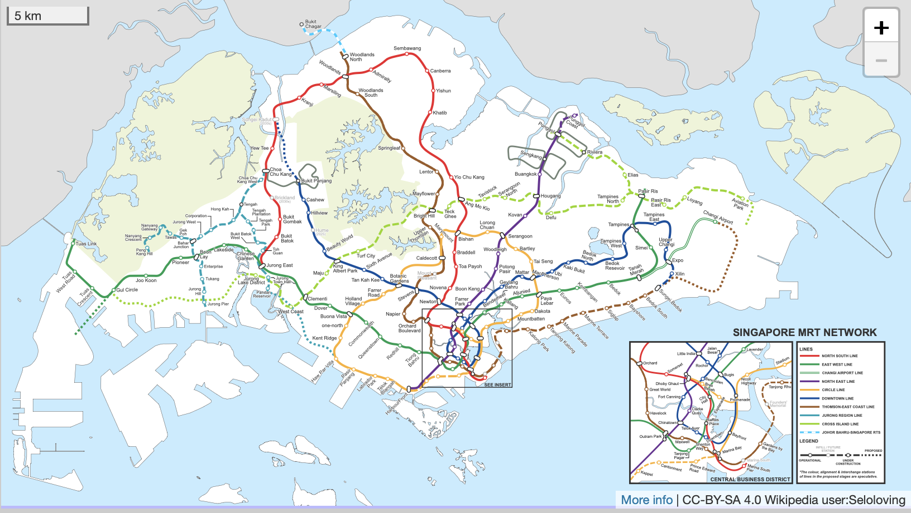
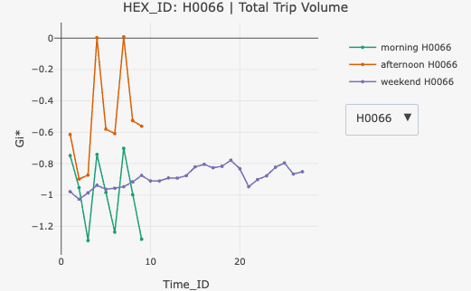
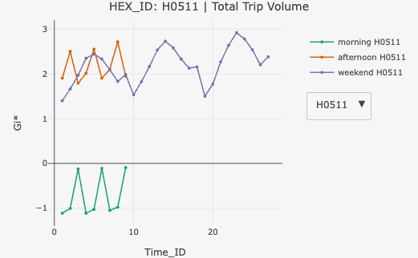
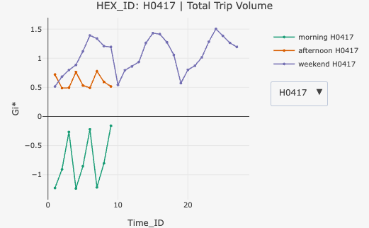
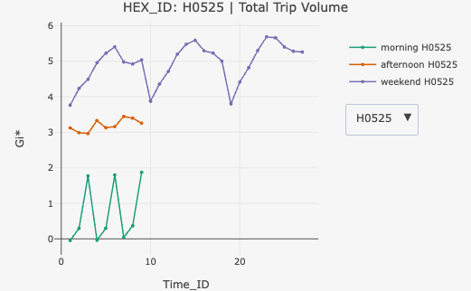
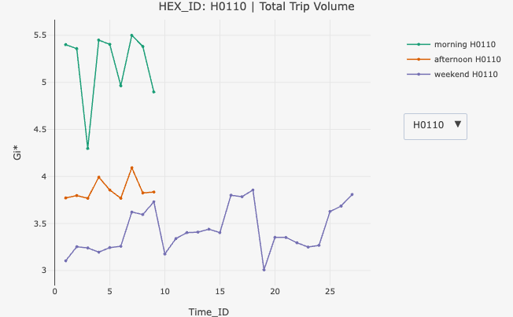
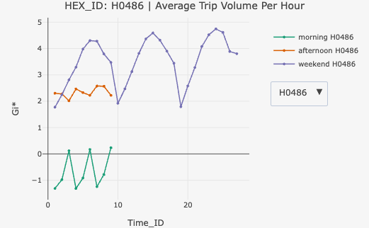
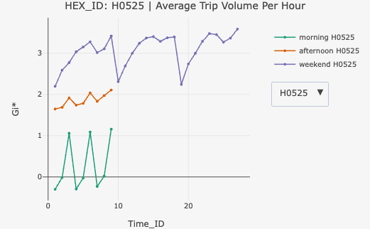

# 1 Set the Scene

The locations of businesses and firms are central to urban development, influencing economic growth, job creation, and the availability of resources and services for residents and other businesses. Strategic locations provide competitive advantages, access to talent and infrastructure, and impact brand image and market positioning, while also shaping the city’s overall character and functionality by fostering specialized districts and facilitating efficient supply chains and employee commutes.

Studying the spatio-temporal patterns of businesses and firms is crucial for urban development because it reveals how economic activity and urban forms evolve, enabling better urban planning, promoting sustainability, identifying urban inefficiencies, and enhancing quality of life. By understanding where and when businesses locate and operate, urban planners can design cities more effectively, anticipate growth, ensure resource efficiency, and tailor infrastructure to support economic vitality and community well-being.

# 2 Objective

Utilize **Local Measures of Spatial Autocorrelation (LMSA)** and **Emerging Hot Spot Analysis (EHSA):**

-   To discover how bus mobility patterns differ across neighborhoods, providing deeper insights than global summary measures.
-   To detect emerging patterns in urban mobility, helping planners anticipate commuting demands and design more responsive bus services and policies.

# 3 Tasks

## 3.1 Geospatial Data Science

-   Derive an analytical hexagon data of 375m (this distance is the perpendicular distance between the centre of the hexagon and its edges) to represent the [traffic analysis zone (TAZ)](https://tmg.utoronto.ca/files/Reports/Traffic-Zone-Guidance_March-2021_Final.pdf).

-   With reference to the time intervals provided in the table below, compute the passenger trips generated by origin at the hexagon level.

    | Peak hour period       | Bus tap on time |
    |------------------------|-----------------|
    | Weekday morning peak   | 6am to 9am      |
    | Weekday afternoon peak | 5pm to 8pm      |
    | Weekend/holiday        | 11am to 8pm     |

-   Display the geographical distribution of the passenger trips by using appropriate geovisualisation methods,

-   Describe the spatial patterns revealed by the geovisualisation (not more than 200 words per visual).

## 3.2 LMSA Analysis

-   Compute LMSA statistic of the passengers trips generate by origin at hexagon level.
-   Display the LMSA maps of the passengers trips generate by origin at hexagon level. The maps should only display the significant (i.e. p-value \< 0.05)
-   With reference to the analysis results, draw statistical conclusions (not more than 200 words per visual).

## 3.3 EHSA Analysis

With reference to the passenger trips by origin at the hexagon level for the three time intervals given above:

-   Perform Mann-Kendall Test by using the spatio-temporal local Gi\* values,
-   Prepared EHSA maps of the Gi\* values of the passenger trips by origin at the hexagon level. The maps should only display the significant (i.e. p-value \< 0.05).
-   With reference to the EHSA maps and data visualisation prepared, describe the spatial patterns reveled. (not more than 250 words per cluster).

# 4 The Data

In this exercise, 3 datasets will be used:

-   **Aspatial: Passenger Volume by Origin Destination Bus Stops from LTA DataMall**

    This dataset contains ridership information (datetime, total trips) showing the flow of passengers between bus stops across Singapore's public bus network.

-   **Geospatial: Bus Stop Location from LTA DataMall**

    This dataset provides the geographical coordinates and attributes of all bus stops in Singapore.

-   **Geospatial: Master Plan 2019 Subzone Boundary (No Sea) from** **data.gov.sg**

    This dataset contains polygon boundaries of Singapore's planning subzones as defined in the Urban Redevelopment Authority's (URA) Master Plan 2019.

# 5 Download and Load the Packages

We first use p_load of pacman to download and load the revelent packages:

| Library | Desc |
|------------------------------------|------------------------------------|
| [sf](https://r-spatial.github.io/sf/) | Handling geospatial data in R with support for simple features (points, lines, polygons) |
| [tmap](https://r-tmap.github.io/tmap/) | Creating thematic maps and visualization for geospatial data |
| [tidyverse](https://www.tidyverse.org) | A collection of packages for data manipulation and analysis, including readr (reading data), tidyr (tidying data), and dplyr (transforming data) |
| [knitr](https://yihui.org/knitr/) | Generating elegant, flexible and fast dynamic reports that integrate code and output |
| [sfdep](https://sfdep.josiahparry.com) | Creating spatial weights matrix objects from polygon contiguities for spatial dependence analysis |
| [Kendall](https://cran.r-project.org/web/packages/Kendall/refman/Kendall.html#Kendall-package) | Computes the Kendall rank correlation and Mann-Kendall trend test |
| [ggplot2](https://ggplot2.tidyverse.org) | Creating sophisticated data visualizations using the grammar of graphics approach |
| [plotly](https://plotly.com/r/) | Building interactive web-based graphs and visualizations |
| [patchwork](https://patchwork.data-imaginist.com) | Combining multiple ggplot2 plots into a single composition with flexible layout control |

```{r}
pacman::p_load(sf, tmap, tidyverse, knitr,
               sfdep, ggplot2, Kendall, plotly, patchwork,
               ggridges,fs,janitor)
```

# 6 Import & Prepare Data

## 6.1 Import and Transform Geospatial Data

We first import **Master Plan 2019 Subzone Boundary** using `read_rds()` function, and then check its coordinate reference system (CRS) using `st_crs()`:

```{r}
mpsz19 <- read_rds("data/rds/mpsz.rds")
st_crs(mpsz19)
```

The result indicates that the MPSZ19 data is already in the SVY21 coordinate system (EPSG:3414), so no further adjustment is needed.

Next, we import **Bus Stop Location Data** using `st_read()` of sf package and transform the EPSG from 9001 to 3414.

```{r}
BusStop <- st_read(dsn = "data/LTADataMall", 
                 layer = "BusStop") %>%
  st_transform(crs = 3414)

```

Let's check if they are any duplicated Bus stop number:

```{r}
duplicated_ids <- BusStop$BUS_STOP_N[duplicated(BusStop$BUS_STOP_N)]

kable(BusStop%>%
        filter(BUS_STOP_N %in% duplicated_ids)%>%
        arrange(BUS_STOP_N))
```

It seems that the duplicated Bus stop numbers are refering to the same location. To avoid counting same location twice, the first one of the duplicated value will be removed:

```{r}
BusStop <- BusStop %>%
  arrange(BUS_STOP_N, desc(row_number())) %>% # ensures last comes first within each group
  distinct(BUS_STOP_N, .keep_all = TRUE)
```

Let's check if there are any duplicated again.

```{r}
BusStop$BUS_STOP_N[duplicated(BusStop$BUS_STOP_N)]
```

Next, we plot the bus stop locations using **tmap** before proceeding with further analysis:

```{r}
#| fig.width: 12
#| fig.height: 8

tm_shape(mpsz19)+
  tm_polygons(fill="REGION_N",fill_alpha=0.5, lwd =0.2)+
tm_shape(BusStop)+
  tm_dots(size = 0.05)+
  tm_layout(bg.color = "#f6f6f6",outer.bg.color = "#f6f6f6",frame = FALSE)+
  tm_legend(frame = FALSE,bg.color = "#f6f6f6")+
  tm_title("Bus Stop Location",
           position = tm_pos_out("center", "top", "center"))

```

As shown in the map, a few bus stops are located outside Singapore, likely near the Johor Bahru checkpoint in Malaysia. Since our analysis focuses on bus stops within Singapore, these bus stops will be removed from the study area.

The code below uses `st_join()` of **sf** package to clip the study area within SG:

```{r}
BS_SG <- st_join(BusStop,mpsz19,
                         join = st_within, left = FALSE)
```

Let's plot the map and check it again:

```{r}
#| fig.width: 12
#| fig.height: 8

tm_shape(mpsz19)+
  tm_polygons(fill="REGION_N",fill_alpha=0.5, lwd =0.2)+
tm_shape(BS_SG)+
  tm_dots(size = 0.05)+
  tm_layout(bg.color = "#f6f6f6",outer.bg.color = "#f6f6f6",frame = FALSE)+
  tm_legend(frame = FALSE,bg.color = "#f6f6f6")+
  tm_title("Bus Stop Locations in Singapore",
           position = tm_pos_out("center", "top", "center"))
```

Now, we can confirm the bus stops located outside of Singapore are all removed.

## 6.2 Import and Prepare Aspatial Data

Since we've downloaded three months of bus trip data from LTA DataMall, the code below uses `dir_ls()` to locate the folder containing the data, and then uses `map_df()` and the `janitor` package to combine all the files into one data frame:

```{r}
#| eval: false
files <- fs::dir_ls("data/LTADataMall/odbus/") 

# Read all files and clean the column names
odbus <- files %>%
  map_df(~ read_csv(.x, 
                    locale = locale(encoding = "latin1"),
                    col_types = cols(.default = "character")
  ) %>% 
    janitor::clean_names()
  ) 
# Save the output
write.csv(odbus, "data/LTADataMall/odbus/odbus.csv", row.names = FALSE)
```

The code below use `read_csv` to import Jul-Sep 2025 bus trip data we just combined:

```{r}
odbus <- read_csv("data/LTADataMall/odbus/odbus.csv")
```

We first view the data:

```{r}
kable(head(odbus))
```

The dataset records the number of passengers boarding and alighting at each bus stop, aggregated by hour. Data are categorized by weekday and weekend/holiday periods, and further grouped by month.

For example, the data below shows the first 10 rows of passenger boarding counts at bus stop **71081** for **July 2025** during the **7 AM hour**.

```{r}
kable(head(odbus %>% filter(origin_pt_code=="71081",
                       year_month=="2025-07",
                       time_per_hour == 7),10))
```

Next, let'scheck its data structure:

```{r}
str(odbus)
```

As shown in the summary above, this dataset contains 17,306,071 observations and 7 attributes. Although `ORIGIN_PT_CODE` and `DESTINATION_PT_CODE` are already in character format, we need to verify that **each** **bus stop code consists of five digits.**

### 6.2.1 Aspatial Data Preperation

We first check if all bus stop codes are 5-digit using `nchar()` - number of char:

```{r}
all(nchar(odbus$origin_pt_code))
all(nchar(odbus$detination_pt_code))

```

The results indicate that all the numbers are 5 digits long, as they return the value “True”.

The code below converts `year_month` to a date format, extracts the month, renames attributes for easier reference, and removes redundant fields ( `year_month`, `pt_type`, `destination_pt_code`) since the analysis is based on origin bus stops:

```{r}
#| eval: false
trips <- odbus %>%
  mutate(year_month = ym(year_month),
         Month=month(year_month))%>%
  rename("BUS_STOP_N" = origin_pt_code) %>%
  rename("Day_Type" = day_type) %>%
  rename("Hour" = time_per_hour) %>%
  rename("Trips" = total_trips) %>%
  select(-"year_month",-"pt_type",-"destination_pt_code")
  

kable(head(trips))
```

```{r}
#| include: false
trips <- read_rds("data/rds/trip.rds")
```

Next, since we only want to examine bus trips within Singapore, the code below uses `inner_join()` to retain only bus stops located in Singapore:

```{r}
trips_SG <- trips %>%
  inner_join(BS_SG)
```

Let's check the data summary:

```{r}
summary(trips_SG)
```

### 6.2.2 Visualization: Average Trips Distribution by Day of Hour and Day Type

Next, let's check the distribution of trips by hour of day and day type. Before visualization, we need to summarize the average trips by Day_Type, Month and Hour first:

```{r}
trips_summary <- trips_SG %>%
  group_by(Day_Type, Month ,Hour) %>%
  summarise(avg_trips = mean(Trips, na.rm = TRUE),.groups = "drop")

```

::: panel-tabset
## Plot

```{r}
#| echo: false
#| fig.width: 12
#| fig.height: 12

trips_summary$Day_Type <- factor(trips_summary$Day_Type, 
                                 levels = c("WEEKENDS/HOLIDAY", "WEEKDAY"))

p <- ggplot(trips_summary, aes(x = Hour, y = Day_Type, fill = Day_Type, 
                                height = avg_trips, group = Day_Type)) +
  geom_ridgeline(scale = 0.1, alpha = 0.7) +
  facet_wrap(~Month, nrow = 3) +  # Show all months at once
  scale_x_continuous(breaks = seq(0, 23, 1)) +
  scale_fill_manual(values = c("#93A4CC", "#8EB859")) +
  labs(
    title = "Average Trips by Month, Hour of Day and Day Type",
    x = "Hour of Day",
    y = ""
  ) +
  geom_vline(xintercept = c(7, 18), color = "grey30", 
             linetype = "dashed", linewidth = 0.3) +
  theme_ridges() +
  theme(
    legend.position = "none",
    axis.text.x = element_text(size = 8),
    axis.text.y = element_text(size = 8),
    axis.title.x = element_text(size = 10,hjust = 0),
    plot.title = element_text(size = 12,hjust = 0.5),
    strip.text = element_text(size = 10),  # Facet title size
    panel.background = element_rect(fill = "#f6f6f6"),
    plot.background = element_rect(fill = "#f6f6f6", color = NA),
    panel.grid = element_blank()
  )

ggplotly(p, tooltip = c("x", "height"),
         )

```

## Code

```{r}
#| eval: false
trips_summary$Day_Type <- factor(trips_summary$Day_Type, 
                                 levels = c("WEEKENDS/HOLIDAY", "WEEKDAY"))

p <- ggplot(trips_summary, aes(x = Hour, y = Day_Type, fill = Day_Type, 
                                height = avg_trips, group = Day_Type)) +
  geom_ridgeline(scale = 0.1, alpha = 0.7) +
  facet_wrap(~Month, nrow = 3) +  # Show all months at once
  scale_x_continuous(breaks = seq(0, 23, 1)) +
  scale_fill_manual(values = c("#93A4CC", "#8EB859")) +
  labs(
    title = "Average Trips by Month, Hour of Day and Day Type",
    x = "Hour of Day",
    y = ""
  ) +
  geom_vline(xintercept = c(7, 18), color = "grey30", 
             linetype = "dashed", linewidth = 0.3) +
  theme_ridges() +
  theme(
    legend.position = "none",
    axis.text.x = element_text(size = 8),
    axis.text.y = element_text(size = 9),
    axis.title.x = element_text(size = 10,hjust = 0),
    plot.title = element_text(size = 12,hjust = 0.5),
    strip.text = element_text(size = 10),  # Facet title size
    panel.background = element_rect(fill = "#f6f6f6"),
    plot.background = element_rect(fill = "#f6f6f6", color = NA),
    panel.grid = element_blank()
  )

ggplotly(p, tooltip = c("x", "height"))
```
:::

::: callout-note
## Observation

On weekdays (green ridges), two distinct peak periods in bus usage are observed: 07:00–08:00 AM, and 18:00–19:00 PM. These peaks are likely driven by commuter traffic, particularly workers traveling to and from their workplaces.

During weekends and holidays (blue ridges), the distribution of trips is more flattened throughout the day, with a consistent average number of trips between 08:00 and 19:00.
:::

# 7 Derive Analytical Hexagons

One of the task is to derive an analytical hexagon data of 375m (this distance is the perpendicular distance between the centre of the hexagon and its edges) to represent the [traffic analysis zone (TAZ)](https://tmg.utoronto.ca/files/Reports/Traffic-Zone-Guidance_March-2021_Final.pdf).

According to the documentation, the cell size of hexagonal cells refers to the distance between opposite edges. Therefore, the cell size in this case is 750 m.

The code below uses st_make_grid() to dervie the hexagon for TAZ:

```{r}
hexagon <- st_make_grid(mpsz19,
                        cellsize = 750, 
                        what = "polygon",
                        square = FALSE) %>% 
  st_sf()

hexagon
```

Note that the hexagon dataset contains only one column with polygon geometries and lacks a unique identifier. To associate hexagons with bus stops, we calculate the number of intersections between the hexagon and `BS_SG` datasets:

```{r}
hexagon$n_collisions <-
  lengths(st_intersects(hexagon, BS_SG))

kable(head(hexagon))
```

Here, `n_collisions = 0` indicates that no bus stops are located within the hexagon, while `n_collisions > 0` means there is at least one bus stop inside the hexagon.

## 7.1 Filter Hexagons for Study Area

Next, we filter `n_collisions` greater than 0 for the study area:

```{r}
hexagon <- filter(hexagon,n_collisions>0)
count(hexagon)
```

There are total 834 hexagon as our study area.

## 7.2 Assign IDs to Each Hexagon

We need an unique identifier for each hexagon for reference. The code below defines and assigns new ID formatting in Hxxx for each hexagon:

```{r}
hexagon <- hexagon %>%
  select(,-n_collisions) # "-" means drop the n_collisions column

hexagon$HEX_ID <- sprintf(
  "H%04d", seq_len(nrow(hexagon))) %>%
  as.factor()
```

Next, we plot our study area using tmap:

```{r}
tm_shape(mpsz19)+
  tm_polygons()+
  tm_shape(hexagon)+
  tm_fill(col= "black",fill="#cc78aa")+
  tm_layout(bg.color = "#f6f6f6",outer.bg.color = "#f6f6f6",frame = FALSE)+
  tm_legend(frame = FALSE)+
  tm_title("Traffic Analysis Zone",
           position = tm_pos_out("center", "top", "center"))
```

## 7.3 Combine Hexagon ID with Trip Data

To combine trip data with the hexagon data, we first need to map each bus stop stop to its corresponding HEX_ID first:

```{r}
bus_hex <- st_intersection(
  BS_SG, hexagon) %>%
  st_drop_geometry() %>%
  select(c(BUS_STOP_N, HEX_ID))%>%
  distinct(BUS_STOP_N, .keep_all = TRUE)


kable(head(bus_hex))
```

Next, we use `inner_join()` to include the trips data within hexagon study areas by bus stop number:

```{r}
trips_SG <- trips_SG %>% 
  inner_join(bus_hex, by = "BUS_STOP_N")
```

```{r}
kable(head(trips_SG))
```

# 8 EDA: Visualize Data by Analytical Hexagon

Before plotting a choropleth map, we need to check the distribution of the bus stops first:

## 8.1 Number of Bus Stop by Analytical Hexagon

To analyze bus mobility across neighboring areas, it is important to know how many bus stops are located within each hexagon. The code below creates a new metric that calculates the number of bus stops contained in each hexagon:

```{r}
hexagon_trip <- hexagon %>%
  mutate(n_bus_stop=lengths(st_intersects(hexagon, BS_SG)))
```

Before plotting a choropleth map, we need to check the distribution of the bus stops first:

```{r}
ggplot(hexagon_trip, aes(x = n_bus_stop)) +
  geom_histogram(bins = 30, fill = "#93A4CC", color = "grey30") +
  labs(title = "Distribution of Bus Stops per Hexagon",
       x = "", y = "Count") +
  theme_minimal()+
  theme(panel.background = element_rect(fill = "#f6f6f6"),
        plot.background = element_rect(fill = "#f6f6f6",color = NA),
        panel.grid = element_blank())

```

As shown in the histogram, the number of bus stops per hexagon is slightly right-skewed, with a median of approximately 5–10. Based on this distribution, the **Jenks natural breaks** method will be used to classify hexagons into low, medium, and high-density groups:

::: panel-tabset
## Plot

```{r}
#| fig.width: 12
#| fig.height: 8
#| echo: false

custom_palette <- c(
  "#c6dbef","#a1d99b", "#fee391","#fdae6b", "#de2d26")
tm_shape(mpsz19)+
  tm_fill(fill_alpha = 0.8)+
  tm_shape(hexagon_trip)+
  tm_polygons(fill = "n_bus_stop",
              fill.legend = tm_legend("# of Bus Stops",
                                      frame = FALSE,
                                      bg = FALSE
                                      ),
              fill.scale = tm_scale_intervals(style = "jenks",
                                              n=5,
                                              values = custom_palette
                                              ),
              fill.chart = tm_chart_histogram())+
  tm_shape(BS_SG)+
  tm_layout(frame = FALSE,
            bg.color = "#f6f6f6",
            outer.bg.color = "#f6f6f6"
            )+
  tm_title("Number of Bus Stops by Analytical Hexagon",
           position = tm_pos_out("center", "top", "center"))

  
```

## Code

```{r}
#| eval: false
custom_palette <- c(
  "#c6dbef","#a1d99b", "#fee391","#fdae6b", "#de2d26")
  
tm_shape(mpsz19)+
  tm_fill(fill_alpha = 0.8)+
  tm_shape(hexagon_trip)+
  tm_polygons(fill = "n_bus_stop",
              fill.legend = tm_legend("# of Bus Stops",
                                      frame = FALSE,
                                      bg = FALSE
                                      ),
              fill.scale = tm_scale_intervals(style = "jenks",
                                              n=5,
                                              values = custom_palette
                                              ),
              fill.chart = tm_chart_histogram())+
  tm_shape(BS_SG)+
  tm_layout(frame = FALSE,
            bg.color = "#f6f6f6",
            outer.bg.color = "#f6f6f6"
            )+
  tm_title("Number of Bus Stops by Analytical Hexagon",
           position = tm_pos_out("center", "top", "center"))

```
:::

::: callout-note
## Observation

The plot reveals a bus location pattern where red spots (bus number\>=12) are mostly surrounded by orange(8-11) and yellow spots(5-7) rather than green(3-4) and blue spots(1-2), suggesting that density decreases outward from certain points, likely corresponding to residential or commercial areas.

In addition, it indicates that the north-eastern region has a higher concentration of bus-stop hexagons compared to other areas.
:::

## 8.2 Total Trips Volume by Month

To examine trip volumes by analytical hexagon, we need to aggregate the number of trips by HEX_ID and then perform a left join with the `hexagon` sf data for plotting:

```{r}
trips_summary <- trips_SG %>%
  group_by(Month,HEX_ID) %>%
  summarise(total_trips = sum(Trips, na.rm = TRUE),
            .groups = "drop")

hexagon_trip <- trips_summary %>% 
  left_join(hexagon_trip)%>%
  st_as_sf()%>%
  relocate(geometry, .after = last_col())

class(hexagon_trip)
```

Let's examine the distribution of total trips across hexagons:

```{r}
ggplot(hexagon_trip, aes(x = total_trips)) +
  geom_histogram(bins = 30, fill = "#93A4CC", color = "grey30") +
  labs(title = "Distribution of Total Trips per Hexagon",
       x = "", y = "Count") +
  theme_minimal()+
  theme(panel.background = element_rect(fill = "#f6f6f6"),
        plot.background = element_rect(fill = "#f6f6f6",color = NA),
        panel.grid = element_blank())
```

Here, we again observe a right-skewed distribution in the data, so the Jenks natural breaks method will be applied. To better visualize the monthly variation in trip volume, `tm_animate()` from the **tmap** package is used:

::: panel-tabset
## Plot

```{r}
#| fig.width: 12
#| fig.height: 8
#| echo: false

temporal_map <- tm_shape(mpsz19)+
  tm_borders()+
  tm_shape(hexagon_trip)+
  tm_polygons(fill = "total_trips",
              fill.legend = tm_legend("Total Trip Volume",
                                      frame = FALSE,
                                      bg = FALSE
                                      ),
              fill.scale = tm_scale_intervals(style = "jenks",
                                              n=5,
                                              values = custom_palette
                                              ))+
  tm_layout(frame = FALSE,
            bg.color = "#f6f6f6",
            outer.bg.color = "#f6f6f6"
            )+
  tm_title("Total Trip Volume by Month",
           position = tm_pos_out("center", "top", "center"))+
  tm_facets(pages = "Month", free.coords = FALSE)

temporal_map +
  tm_animate(frame = "Month",fps=1,delay = 2000)
```

## Code

```{r}
#| eval: false

temporal_map <- tm_shape(mpsz19)+
  tm_borders()+
  tm_shape(hexagon_trip)+
  tm_polygons(fill = "total_trips",
              fill.legend = tm_legend("Total Trip Volume",
                                      frame = FALSE,
                                      bg = FALSE
                                      ),
              fill.scale = tm_scale_intervals(style = "jenks",
                                              n=5,
                                              values = custom_palette
                                              ))+
  tm_layout(frame = FALSE,
            bg.color = "#f6f6f6",
            outer.bg.color = "#f6f6f6"
            )+
  tm_title("Total Trip Volume by Month",
           position = tm_pos_out("center", "top", "center"))+
  tm_facets(pages = "Month", free.coords = FALSE)

temporal_map +
  tm_animate(frame = "Month",fps=1,delay = 2000)
```
:::

Let's print the top 10 hexagons with highest trip volume each month for reference:

```{r}
kable(hexagon_trip %>%
        filter(Month==7)%>%
  arrange(desc(total_trips), desc(n_bus_stop)) %>%
  slice(1:10))

kable(hexagon_trip %>%
        filter(Month==8)%>%
  arrange(desc(total_trips), desc(n_bus_stop)) %>%
  slice(1:10))

kable(hexagon_trip %>%
        filter(Month==9)%>%
  arrange(desc(total_trips), desc(n_bus_stop)) %>%
  slice(1:10))
```

The code below aggregate the trip volume by month.

```{r}
monthly_count <- hexagon_trip %>%
  group_by(Month)%>%
  summarise(total_trips = sum(total_trips, na.rm = TRUE),
            .groups = "drop")

kable(monthly_count)
```

The result shows that the September total trips have decreased by 9% compared to August.

::: callout-note
## Observation

The composition of the top 10 highest-volume hexagons remains stable across all three months: **H0110 (Jurong West/Boonlay), H0315 (Woodlands Central), H0768 (Tampines), H0518 (Ang Mo Kio), H0242 (Clementi), H0735 (Bedok), H0272 (Woodlands Checkpoint), H0515 (Toa Payoh), H0594 (Serangoon), and H0663 (Sengkang**). This consistency indicates structurally high demand at these major residential centers and transport interchanges, with no significant shifts in spatial distribution of ridership during the study period.
:::

## 8.3 Average Trip Volume Per Stop by Month

It's also important to know the trip volume per bus stop, as it helps us understand if the bus stop capacity is overloaded and identify hotspots for bus traffic:

```{r}
hexagon_trip <- hexagon_trip %>%
  mutate(avg_volume = total_trips / n_bus_stop)%>%
  relocate(geometry, .after = last_col())
```

::: panel-tabset
## Plot

```{r}
#| fig.width: 12
#| fig.height: 8
#| echo: false

temporal_map2 <- tm_shape(mpsz19)+
  tm_borders(fill_alpha = 0.8)+
  tm_shape(hexagon_trip)+
  tm_polygons(fill = "avg_volume",
              fill.legend = tm_legend("Average Trip Volume",
                                      frame = FALSE,
                                      bg = FALSE
                                      ),
              fill.scale = tm_scale_intervals(style = "jenks",
                                              n=5,
                                              values = custom_palette
                                              ))+
  tm_layout(frame = FALSE,
            bg.color = "#f6f6f6",
            outer.bg.color = "#f6f6f6"
            )+
  tm_title("Average Bus Trip Volume per Stop by Month",
           position = tm_pos_out("center", "top", "center"))+
  tm_facets(pages = "Month", free.coords = FALSE)

temporal_map2 + 
  tm_animate(frame = "Month",fps=1,delay = 2000)

```

## Code

```{r}
#| eval: false


temporal_map2 <- tm_shape(mpsz19)+
  tm_borders(fill_alpha = 0.8)+
  tm_shape(hexagon_trip)+
  tm_polygons(fill = "avg_volume",
              fill.legend = tm_legend("Average Trip Volume",
                                      frame = FALSE,
                                      bg = FALSE
                                      ),
              fill.scale = tm_scale_intervals(style = "jenks",
                                              n=5,
                                              values = custom_palette
                                              ))+
  tm_layout(frame = FALSE,
            bg.color = "#f6f6f6",
            outer.bg.color = "#f6f6f6"
            )+
  tm_legend(frame = FALSE)+
  tm_title("Average Bus Trip Volume per Stop by Month",
           position = tm_pos_out("center", "top", "center"))+
  tm_facets(pages = "Month", free.coords = FALSE)

temporal_map2 + 
  tm_animate(frame = "Month",fps=1,delay = 2000)
```
:::

```{r}
kable(hexagon_trip %>%
        filter(Month==7)%>%
  arrange(desc(avg_volume), desc(n_bus_stop)) %>%
  slice(1:10))

kable(hexagon_trip %>%
        filter(Month==8)%>%
  arrange(desc(avg_volume), desc(n_bus_stop)) %>%
  slice(1:10))

kable(hexagon_trip %>%
        filter(Month==9)%>%
  arrange(desc(avg_volume), desc(n_bus_stop)) %>%
  slice(1:10))
```

::: callout-note
## Observation

The intersection of the top 10 hexagons by **average trips per bus stop** and **total trip volume** across all months includes **H0110 (Jurong West/Boon Lay)**, **H0315 (Woodlands)**, **H0768 (Tampines)**, **H0518 (Ang Mo Kio)**, **H0735 (Bedok)** and **H0272 (Woodlands Checkpoint)**. These locations consistently experience heavy bus traffic and substantial passenger boardings, indicating their role as key transit hubs in the network.

Additionally, several hexagons such as **H0783 (Pasir Ris)**, **H0249 (Kranji)**, **H0823 (Changi)** and **H0529 (Bishan)**, while not ranked among the top 10 in total trip volume, still record high **average trips per bus stop** across all three months. Each of these hexagons reports average passenger volumes per bus stop exceeding **131,000**, suggesting that they serve high-intensity local demand despite lower overall network totals.
:::

## 8.4 Average Trips by Peak Hour Period and Hexagon

Following the task instructions, the `peak` variable was created using the `mutate()` and `case_when()` functions. Since Hour 6 represents the time range 6:00-6:59, the code below categorizes 6:00-8:59 as the `Weekday AM Peak` , 17:00-19:59 as the `Weekday PM peak` and 11:00-19:59 as the `Weekend/Holiday Peak`:

```{r}
trips_SG <- trips_SG %>%
  mutate(
    Peak = case_when(
      Day_Type == "WEEKDAY" & Hour >= 6 & Hour < 9  ~ "Weekday AM Peak",
      Day_Type == "WEEKDAY" & Hour >= 17 & Hour < 20 ~ "Weekday PM Peak",
      Day_Type == "WEEKENDS/HOLIDAY" & Hour >= 11 & Hour < 20 ~ "Weekend/Holiday Peak",
      TRUE ~ "Off Peak"
    )
  )
```

### 8.4.1 Monthly Average Trip Volume During Peak Period

Next, the data are aggregated by HEX_ID and peak period to calculate the average trip volume per peak period, allowing for direct comparison of trip intensity across the three peak periods.

The code below divides the sum of trips by 66 days for weekdays and 26 days for weekend/holiday from July to September:

```{r}
trips_summary_peak <- trips_SG %>%
  group_by(HEX_ID, Peak) %>% 
  filter(Peak %in%c("Weekday AM Peak", "Weekday PM Peak","Weekend/Holiday Peak")) %>%
  summarise(total_trips = sum(Trips, na.rm = TRUE), .groups = "drop") %>%
  mutate(
    average_trips_peak = case_when(
      Peak %in% c("Weekday AM Peak", "Weekday PM Peak") ~ total_trips / 66,
      Peak == "Weekend/Holiday Peak" ~ total_trips / 26,
      TRUE ~ total_trips
    )
  ) %>%
  left_join(hexagon, by = "HEX_ID") %>%
  st_sf()

```

Since the total trips during peak hours are still fairly right-skewed (as box plots show), we use "jenks" natural break method to highlight areas with disproportionately high values:

::: panel-tabset
## Plot

```{r}
#| echo: false
#| fig-height: 15
#| fig-width: 12

WK <- tm_shape(mpsz19)+
  tm_polygons(fill_alpha = 0.5,lwd =0.5,col_alpha=0.5)+
tm_shape(trips_summary_peak %>% filter (Peak=="Weekend/Holiday Peak"))+
  tm_polygons(fill = "average_trips_peak",
              fill.legend = tm_legend("Avg Trips during Peak",
                                      frame = FALSE,
                                      bg = FALSE
                                      ),
              fill.scale = tm_scale_intervals(style = "jenks",
                                              n=5,
                                              values = custom_palette
                                              ),
              fill.chart = tm_chart_box()
              )+
  tm_layout(frame = FALSE,
            bg.color = "#f6f6f6",
            outer.bg.color = "#f6f6f6"
            )+
  tm_title("Weekend/Holiday Peak: 11-20",
           position = tm_pos_out("center", "top", "center"))


WD_AM <- tm_shape(mpsz19)+
  tm_polygons(fill_alpha = 0.5,lwd =0.5,col_alpha=0.5)+
tm_shape(trips_summary_peak %>% filter (Peak=="Weekday AM Peak"))+
  tm_polygons(fill = "average_trips_peak",
              fill.legend = tm_legend("Avg Trips during Peak",
                                      frame = FALSE,
                                      bg = FALSE
                                      ),
              fill.scale = tm_scale_intervals(style = "jenks",
                                              n=5,
                                              values = custom_palette
                                              ),
              fill.chart = tm_chart_box())+
  tm_layout(frame = FALSE,
            bg.color = "#f6f6f6",
            outer.bg.color = "#f6f6f6"
            )+
  tm_title("Weekday AM Peak: 6-9",
           position = tm_pos_out("center", "top", "center"))

WD_PM <- tm_shape(mpsz19)+
  tm_polygons(fill_alpha = 0.5,lwd =0.5,col_alpha=0.5)+
tm_shape(trips_summary_peak %>% filter (Peak=="Weekday PM Peak"))+
  tm_polygons(fill = "average_trips_peak",
              fill.legend = tm_legend("Avg Trips during Peak",
                                      frame = FALSE,
                                      bg = FALSE
                                      ),
              fill.scale = tm_scale_intervals(style = "jenks",
                                              n=5,
                                              values = custom_palette
                                              ),
              fill.chart = tm_chart_box())+
  tm_layout(frame = FALSE,
            bg.color = "#f6f6f6",
            outer.bg.color = "#f6f6f6"
            )+
  tm_title("Weekday PM Peak: 17-20",
           position = tm_pos_out("center", "top", "center"))


tmap_arrange(WD_AM, WD_PM,WK,ncol = 1,nrow=3)
```

## Code

```{r}
#| eval: false

WK <- tm_shape(mpsz19)+
  tm_polygons(fill_alpha = 0.5,lwd =0.5,col_alpha=0.5)+
tm_shape(trips_summary_peak %>% filter (Peak=="Weekend/Holiday Peak"))+
  tm_polygons(fill = "average_trips_peak",
              fill.legend = tm_legend("Avg Trips during Peak",
                                      frame = FALSE,
                                      bg = FALSE
                                      ),
              fill.scale = tm_scale_intervals(style = "jenks",
                                              n=5,
                                              values = custom_palette
                                              ),
              fill.chart = tm_chart_box()
              )+
  tm_layout(frame = FALSE,
            bg.color = "#f6f6f6",
            outer.bg.color = "#f6f6f6"
            )+
  tm_title("Weekend/Holiday Peak: 11-20",
           position = tm_pos_out("center", "top", "center"))


WD_AM <- tm_shape(mpsz19)+
  tm_polygons(fill_alpha = 0.5,lwd =0.5,col_alpha=0.5)+
tm_shape(trips_summary_peak %>% filter (Peak=="Weekday AM Peak"))+
  tm_polygons(fill = "average_trips_peak",
              fill.legend = tm_legend("Avg Trips during Peak",
                                      frame = FALSE,
                                      bg = FALSE
                                      ),
              fill.scale = tm_scale_intervals(style = "jenks",
                                              n=5,
                                              values = custom_palette
                                              ),
              fill.chart = tm_chart_box())+
  tm_layout(frame = FALSE,
            bg.color = "#f6f6f6",
            outer.bg.color = "#f6f6f6"
            )+
  tm_title("Weekday AM Peak: 6-9",
           position = tm_pos_out("center", "top", "center"))

WD_PM <- tm_shape(mpsz19)+
  tm_polygons(fill_alpha = 0.5,lwd =0.5,col_alpha=0.5)+
tm_shape(trips_summary_peak %>% filter (Peak=="Weekday PM Peak"))+
  tm_polygons(fill = "average_trips_peak",
              fill.legend = tm_legend("Avg Trips during Peak",
                                      frame = FALSE,
                                      bg = FALSE
                                      ),
              fill.scale = tm_scale_intervals(style = "jenks",
                                              n=5,
                                              values = custom_palette
                                              ),
              fill.chart = tm_chart_box())+
  tm_layout(frame = FALSE,
            bg.color = "#f6f6f6",
            outer.bg.color = "#f6f6f6"
            )+
  tm_title("Weekday PM Peak: 17-20",
           position = tm_pos_out("center", "top", "center"))


tmap_arrange(WD_AM, WD_PM,WK,ncol = 1,nrow=3)
```
:::

```{r}
kable(trips_summary_peak %>%
        filter(Peak=="Weekday PM Peak")%>%
        select(Peak,HEX_ID,total_trips,average_trips_peak)%>%
  arrange(desc(average_trips_peak)) %>%
  slice(1:10))

kable(trips_summary_peak %>%
        filter(Peak=="Weekday AM Peak")%>%
        select(Peak,HEX_ID,total_trips,average_trips_peak)%>%
  arrange(desc(average_trips_peak)) %>%
  slice(1:10))

kable(trips_summary_peak %>%
        filter(Peak=="Weekend/Holiday Peak")%>%
        select(Peak,HEX_ID,total_trips,average_trips_peak)%>%
  arrange(desc(average_trips_peak)) %>%
  slice(1:10))
```

::: callout-note
## Observation

There are four hexagon consistenly showing red across there peak hour periods: H0110 (Boonlay Int, Jurong West Central), H0315 (Woodlands Region Central), H0518(Ang Mo Kio Town Center), H0242(Clementi) suggesting these four hexagons are major transport hubs.

From the plot above, we can observe that during the weekday AM peak, the northern, north-eastern, and western areas are busier than other regions. Compared to the PM peak, the orange and yellow hues are more widely distributed across the map, suggesting that commuters are likely boarding buses from the nearest bus stops to their homes.

For the weekday PM peak period, red spots are more spread out, especially toward eastern regions, reflecting dispersed evening departures, likely from bus stops near to workplaces. The central and eastern part of Singapore are much more busier than western part during the PM peak than AM peak.

For the weekend peak hours, overall trip volumes decrease significantly compared to weekdays, and the trips are more evenly distributed across the study area.
:::

### 8.4.2 Monthly Average Trip Volume by Peak Hour

For a more detailed breakdown, the plots below group the data by HEX_ID, Peak and Hour, showing the total number of trips across all months for each hour during three peak time period:

```{r}
trips_summary_hour <- trips_SG %>%
  group_by(HEX_ID, Peak, Hour) %>%
  filter(Peak %in%c("Weekday AM Peak", "Weekday PM Peak","Weekend/Holiday Peak")) %>%
  summarise(total_trips = sum(Trips, na.rm = TRUE), .groups = "drop") %>%
  mutate(
    average_trips_hour = case_when(
      Peak %in% c("Weekday AM Peak", "Weekday PM Peak") ~ total_trips / 66,
      TRUE ~ total_trips / 26
    )
  ) %>%
  left_join(hexagon, by = "HEX_ID") %>%
  st_sf()

```

::: panel-tabset
## Weekday AM Peak

```{r}
#| echo: false
#| fig.width: 12
#| fig.height: 8

WD_AM <- tm_shape(mpsz19)+
  tm_polygons(fill_alpha = 0.5,lwd =0.5,col_alpha=0.5)+
tm_shape(trips_summary_hour %>% filter (Peak=="Weekday AM Peak"))+
  tm_polygons(fill = "average_trips_hour",
              fill.legend = tm_legend("Average Trips Per Hour",
                                      frame = FALSE,
                                      bg = FALSE
                                      ),
              fill.scale = tm_scale_intervals(style = "jenks",
                                              n=5,
                                              values = custom_palette
                                              ),
              fill.chart = tm_chart_violin())+
  tm_layout(frame = FALSE,
            bg.color = "#f6f6f6",
            outer.bg.color = "#f6f6f6"
            )+
  tm_title("Weekday AM Peak: 6AM - 9AM",
           position = tm_pos_out("center", "top", "center"))
  
WD_AM + tm_animate(frame = "Hour",fps =1,delay = 2000)
```

```{r}
#| eval: false
WD_AM <- tm_shape(mpsz19)+
  tm_polygons(fill_alpha = 0.5,lwd =0.5,col_alpha=0.5)+
tm_shape(trips_summary_hour %>% filter (Peak=="Weekday AM Peak"))+
  tm_polygons(fill = "average_trips_hour",
              fill.legend = tm_legend("Average Trips Per Hour",
                                      frame = FALSE,
                                      bg = FALSE
                                      ),
              fill.scale = tm_scale_intervals(style = "jenks",
                                              n=5,
                                              values = custom_palette
                                              ),
              fill.chart = tm_chart_violin())+
  tm_layout(frame = FALSE,
            bg.color = "#f6f6f6",
            outer.bg.color = "#f6f6f6"
            )+
  tm_title("Weekday AM Peak: 6AM - 9AM",
           position = tm_pos_out("center", "top", "center"))
  
WD_AM + tm_animate(frame = "Hour",fps =1,delay = 2000)
```

## Weekday PM Peak

```{r}
#| fig.width: 12
#| fig.height: 8
#| echo: false

WD_PM <- tm_shape(mpsz19)+
  tm_polygons(fill_alpha = 0.5,lwd =0.5,col_alpha=0.5)+
tm_shape(trips_summary_hour %>% filter (Peak=="Weekday PM Peak"))+
  tm_polygons(fill = "average_trips_hour",
              fill.legend = tm_legend("Average Trips Per Hour",
                                      frame = FALSE,
                                      bg = FALSE
                                      ),
              fill.scale = tm_scale_intervals(style = "jenks",
                                              n=5,
                                              values = custom_palette
                                              ),
              fill.chart = tm_chart_violin())+
  tm_layout(frame = FALSE,
            bg.color = "#f6f6f6",
            outer.bg.color = "#f6f6f6"
            )+
  tm_title("Weekday PM Peak: 5PM - 8PM",
           position = tm_pos_out("center", "top", "center"))

WD_PM + tm_animate(frame = "Hour",fps =1,delay = 2000)

```

```{r}
#| eval: false
WD_PM <- tm_shape(mpsz19)+
  tm_polygons(fill_alpha = 0.5,lwd =0.5,col_alpha=0.5)+
tm_shape(trips_summary_hour %>% filter (Peak=="Weekday PM Peak"))+
  tm_polygons(fill = "average_trips_hour",
              fill.legend = tm_legend("Average Trips Per Hour",
                                      frame = FALSE,
                                      bg = FALSE
                                      ),
              fill.scale = tm_scale_intervals(style = "jenks",
                                              n=5,
                                              values = custom_palette
                                              ),
              fill.chart = tm_chart_violin())+
  tm_layout(frame = FALSE,
            bg.color = "#f6f6f6",
            outer.bg.color = "#f6f6f6"
            )+
  tm_title("Weekday PM Peak: 5PM - 8PM",
           position = tm_pos_out("center", "top", "center"))

WD_PM + tm_animate(frame = "Hour",fps =1,delay = 2000)

```

## Weekend/Holiday

```{r}
#| echo: false
#| fig.width: 12
#| fig.height: 8

WK <- tm_shape(mpsz19)+
  tm_polygons(fill_alpha = 0.5,lwd =0.5,col_alpha=0.5)+
tm_shape(trips_summary_hour %>% filter (Peak=="Weekend/Holiday Peak"))+
  tm_polygons(fill = "average_trips_hour",
              fill.legend = tm_legend("Average Trips Per Hour",
                                      frame = FALSE,
                                      bg = FALSE
                                      ),
              fill.scale = tm_scale_intervals(style = "jenks",
                                              n=5,
                                              values = custom_palette
                                              ),
              fill.chart = tm_chart_violin())+
  tm_layout(frame = FALSE,
            bg.color = "#f6f6f6",
            outer.bg.color = "#f6f6f6"
            )+
  tm_title("Weekend/Holiday Peak: 11AM - 8PM",
           position = tm_pos_out("center", "top", "center"))+
  tm_facets(pages = "Hour", free.coords = FALSE)
  
WK + tm_animate(frame = "Hour",fps =1,delay = 2000)
```

```{r}
#| eval: false

WK <- tm_shape(mpsz19)+
  tm_polygons(fill_alpha = 0.5,lwd =0.5,col_alpha=0.5)+
tm_shape(trips_summary_hour %>% filter (Peak=="Weekend/Holiday Peak"))+
  tm_polygons(fill = "average_trips_hour",
              fill.legend = tm_legend("Average Trips Per Hour",
                                      frame = FALSE,
                                      bg = FALSE
                                      ),
              fill.scale = tm_scale_intervals(style = "jenks",
                                              n=5,
                                              values = custom_palette
                                              ),
              fill.chart = tm_chart_violin())+
  tm_layout(frame = FALSE,
            bg.color = "#f6f6f6",
            outer.bg.color = "#f6f6f6"
            )+
  tm_title("Weekend/Holiday Peak: 11AM - 8PM",
           position = tm_pos_out("center", "top", "center"))+
  tm_facets(pages = "Hour", free.coords = FALSE)
  
WK + tm_animate(frame = "Hour",fps =1,delay = 2000)
```
:::

# 9 LMSA Analysis: Hot Spot/Cold Spot analysis

To support the LMSA analysis, Hot Spot/Cold Spot analysis (HCSA) based on the Getis-Ord Gi\* statistic will be performed:

```{r}
trips_hcsa <- trips_SG %>%
  group_by(HEX_ID,Peak)%>%
  summarise(total_trips = sum(Trips,na.rm = TRUE),
            hours = n_distinct(Hour, na.rm = TRUE),
            .groups = "drop")%>%
  mutate(days = case_when(Peak == "Weekend/Holiday Peak" ~ 26,
                            TRUE ~ 66),
            avg_trips_hr = (total_trips/hours)/days,)
  
trips_hcsa <- hexagon%>%
  inner_join(trips_hcsa, by = "HEX_ID")
```

## 9.1 Derive Adaptive Distance Weight Matrix

Since some of the hexagons on the rightmost of Singapore are isolated, and no neighbors directly connected on the edges. The **adaptive distance weight matrix** - KNN method will be used to ensure every hexagon has neighbors.

The code chunk below is used to derive a KNN nb with equal weights assigned to each neighbor:

```{r}
wm_knn <- trips_hcsa %>%
  mutate(
    nb = include_self(st_knn(geometry,k=6)), # ensure 6 neighbors (include self)
    wt = st_weights(nb,style = "W"),
    .before = 1)
```

## 9.2 Compute Gi\*

The code below uses `mutate()` to add a new column called `gistar`, which stores the results of `local_gstar_perm()`. This function computes the local Gi\* statistic, a spatial measure used to identify local clusters of high values (hot spots) and low values (cold spots).

The hypothesis of `local_gstar_perm()`:

-   **H0:** There is no spatial clustering of the variable of interest.
-   **H1:** There is spatial clustering (hot spot or cold spot) at a location.
-   **Significance**: 5% (since this is a two-sided test, the critical region is split between the two tails of the distribution, each side is 2.5%)

### 9.2.1 Total Trips During Peak Hour Period

```{r}
set.seed(1234)

trips_hcsa_wk <- wm_knn %>%
  mutate(
    gistar = local_gstar_perm(
      total_trips, nb, wt, nsim = 999,
      alternative = "two.sided"),
    .before = 1) %>%
  unnest(gistar)

trips_hcsa_am <- wm_knn %>%
  mutate(
    gistar = local_gstar_perm(
      total_trips, nb, wt, nsim = 999,
      alternative = "two.sided"),
    .before = 1) %>%
  unnest(gistar)

trips_hcsa_pm <- wm_knn %>%
  mutate(
    gistar = local_gstar_perm(
      total_trips, nb, wt, nsim = 999,
      alternative = "two.sided"),
    .before = 1) %>%
  unnest(gistar)
```

### 9.2.2 Average Trips Per Peak Hour

```{r}
trips_hcsa_wk_hr <- wm_knn %>%
  mutate(
    gistar = local_gstar_perm(
      avg_trips_hr, nb, wt, nsim = 999,
      alternative = "two.sided"),
    .before = 1) %>%
  unnest(gistar)

trips_hcsa_am_hr <- wm_knn %>%
  mutate(
    gistar = local_gstar_perm(
      avg_trips_hr, nb, wt, nsim = 999,
      alternative = "two.sided"),
    .before = 1) %>%
  unnest(gistar)

trips_hcsa_pm_hr <- wm_knn %>%
  mutate(
    gistar = local_gstar_perm(
      avg_trips_hr, nb, wt, nsim = 999,
      alternative = "two.sided"),
    .before = 1) %>%
  unnest(gistar)
```

## 9.3 HCSA - Peak Hour Trip Patterns Analysis

Here we visualize cold/hot spots using a two-sided test, filtering locations with folded simulated p-values \< 0.025, where:

-   **Gi\* \> 0 & `p_sim_folded` \<= 0.025 → Hot spot**
-   **Gi\* \< 0 & `p_sim_folded`\<= 0.025 → Cold spot**

### 9.3.1 Total Trips During Peak Hour Period

::: panel-tabset
## Plot

```{r}
#| fig-height: 15
#| fig-width: 10
#| echo: false

wk <- tm_shape(mpsz19)+
  tm_fill(fill_alpha = 0.5)+
  tm_shape(hexagon) + 
  tm_borders(col = "grey30", col_alpha=0.5)+
tm_shape(trips_hcsa_wk %>% filter(p_folded_sim <= 0.025))+
  tm_polygons("cluster",
          fill.scale = tm_scale_categorical(
               values= c("#c6dbef","#de2d26")
              ))+
  tm_title("Hot Spot and Cold Spot During Weenkend/Holiday Peak Hours - Total Trips",
           position = tm_pos_out("center", "top", "center"))+
  tm_layout(frame = FALSE,
            bg.color = "#f6f6f6",
            outer.bg.color = "#f6f6f6"
            )

am <- 
  tm_shape(mpsz19)+
  tm_fill(fill_alpha = 0.5)+
  tm_shape(hexagon) + 
  tm_borders(col = "grey30", col_alpha=0.5)+
tm_shape(trips_hcsa_am %>% filter(p_folded_sim <= 0.025))+
  tm_polygons("cluster",
          fill.scale = tm_scale_categorical(
               values= c("#c6dbef","#de2d26")
          ))+
  tm_title("Hot and Cold Spots During Weekday AM Peak Hours - Total Trips",
           position = tm_pos_out("center", "top", "center"))+
  tm_layout(frame = FALSE,
            bg.color = "#f6f6f6",
            outer.bg.color = "#f6f6f6"
            )

pm <- 
  tm_shape(mpsz19)+
  tm_fill(fill_alpha = 0.5)+
  tm_shape(hexagon) + 
  tm_borders(col = "grey30", col_alpha=0.5)+
tm_shape(trips_hcsa_pm %>% filter(p_folded_sim <= 0.025))+
  tm_polygons("cluster",
          fill.scale = tm_scale_categorical(
               values= c("#c6dbef","#de2d26")
          ))+
  tm_title("Hot and Cold Spots During Weekday PM Peak Hours - Total Trips",
           position = tm_pos_out("center", "top", "center"))+
  tm_layout(frame = FALSE,
            bg.color = "#f6f6f6",
            outer.bg.color = "#f6f6f6"
            )

tmap_arrange(am,pm,wk,ncol=1,nrow=3)
```

## Code

```{r}
#| fig-height: 15
#| fig-width: 10
#| eval: false


wk <- tm_shape(mpsz19)+
  tm_fill(fill_alpha = 0.5)+
  tm_shape(hexagon) + 
  tm_borders(col = "grey30", col_alpha=0.5)+
tm_shape(trips_hcsa_wk %>% filter(p_folded_sim <= 0.025))+
  tm_polygons("cluster",
          fill.scale = tm_scale_categorical(
               values= c("#c6dbef","#de2d26")
              ))+
  tm_title("Hot Spot and Cold Spot During Weenkend/Holiday Peak Hours - Total Trips",
           position = tm_pos_out("center", "top", "center"))+
  tm_layout(frame = FALSE,
            bg.color = "#f6f6f6",
            outer.bg.color = "#f6f6f6"
            )

am <- 
  tm_shape(mpsz19)+
  tm_fill(fill_alpha = 0.5)+
  tm_shape(hexagon) + 
  tm_borders(col = "grey30", col_alpha=0.5)+
tm_shape(trips_hcsa_am %>% filter(p_folded_sim <= 0.025))+
  tm_polygons("cluster",
          fill.scale = tm_scale_categorical(
               values= c("#c6dbef","#de2d26")
          ))+
  tm_title("Hot and Cold Spots During Weekday AM Peak Hours - Total Trips",
           position = tm_pos_out("center", "top", "center"))+
  tm_layout(frame = FALSE,
            bg.color = "#f6f6f6",
            outer.bg.color = "#f6f6f6"
            )

pm <- 
  tm_shape(mpsz19)+
  tm_fill(fill_alpha = 0.5)+
  tm_shape(hexagon) + 
  tm_borders(col = "grey30", col_alpha=0.5)+
tm_shape(trips_hcsa_pm %>% filter(p_folded_sim <= 0.025))+
  tm_polygons("cluster",
          fill.scale = tm_scale_categorical(
               values= c("#c6dbef","#de2d26")
          ))+
  tm_title("Hot and Cold Spots During Weekday PM Peak Hours - Total Trips",
           position = tm_pos_out("center", "top", "center"))+
  tm_layout(frame = FALSE,
            bg.color = "#f6f6f6",
            outer.bg.color = "#f6f6f6"
            )

tmap_arrange(am,pm,wk,ncol=1,nrow=3)
```
:::

### 9.3.2 Average Trips Per Peak Hour

::: panel-tabset
## Plot

```{r}
#| fig-height: 15
#| fig-width: 10
#| echo: false

wk <- tm_shape(mpsz19)+
  tm_fill(fill_alpha = 0.5)+
  tm_shape(hexagon) + 
  tm_borders(col = "grey30", col_alpha=0.5)+
tm_shape(trips_hcsa_wk_hr %>% filter(p_folded_sim <= 0.025))+
  tm_polygons("cluster",
          fill.scale = tm_scale_categorical(
               values= c("#c6dbef","#de2d26")
          ))+
  tm_title("Hot Spot and Cold Spot During Weenkend/Holiday Peak Hours - Average Trips Per Hour",
           position = tm_pos_out("center", "top", "center"))+
  tm_layout(frame = FALSE,
            bg.color = "#f6f6f6",
            outer.bg.color = "#f6f6f6"
            )

am <- 
  tm_shape(mpsz19)+
  tm_fill(fill_alpha = 0.5)+
  tm_shape(hexagon) + 
  tm_borders(col = "grey30", col_alpha=0.5)+
tm_shape(trips_hcsa_am_hr %>% filter(p_folded_sim <= 0.025))+
  tm_polygons("cluster",
          fill.scale = tm_scale_categorical(
               values= c("#c6dbef","#de2d26")
          ))+
  tm_title("Hot and Cold Spots During Weekday AM Peak Hours - Average Trips Per Hour",
           position = tm_pos_out("center", "top", "center"))+
  tm_layout(frame = FALSE,
            bg.color = "#f6f6f6",
            outer.bg.color = "#f6f6f6"
            )

pm <- 
  tm_shape(mpsz19)+
  tm_fill(fill_alpha = 0.5)+
  tm_shape(hexagon) + 
  tm_borders(col = "grey30", col_alpha=0.5)+
tm_shape(trips_hcsa_pm_hr %>% filter(p_folded_sim <= 0.025))+
  tm_polygons("cluster",
          fill.scale = tm_scale_categorical(
               values= c("#c6dbef","#de2d26")
          ))+
  tm_title("Hot and Cold Spots During Weekday PM Peak Hours - Average Trips Per Hour",
           position = tm_pos_out("center", "top", "center"))+
  tm_layout(frame = FALSE,
            bg.color = "#f6f6f6",
            outer.bg.color = "#f6f6f6"
            )

tmap_arrange(am,pm,wk,ncol=1,nrow=3)
```

## Code

```{r}
#| fig-height: 15
#| fig-width: 10
#| eval: false

wk <- tm_shape(mpsz19)+
  tm_fill(fill_alpha = 0.5)+
  tm_shape(hexagon) + 
  tm_borders(col = "grey30", col_alpha=0.5)+
tm_shape(trips_hcsa_wk_hr %>% filter(p_folded_sim <= 0.025))+
  tm_polygons("cluster",
          fill.scale = tm_scale_categorical(
               values= c("#c6dbef","#de2d26")
          ))+
  tm_title("Hot Spot and Cold Spot During Weenkend/Holiday Peak Hours - Average Trips Per Hour",
           position = tm_pos_out("center", "top", "center"))+
  tm_layout(frame = FALSE,
            bg.color = "#f6f6f6",
            outer.bg.color = "#f6f6f6"
            )

am <- 
  tm_shape(mpsz19)+
  tm_fill(fill_alpha = 0.5)+
  tm_shape(hexagon) + 
  tm_borders(col = "grey30", col_alpha=0.5)+
tm_shape(trips_hcsa_am_hr %>% filter(p_folded_sim <= 0.025))+
  tm_polygons("cluster",
          fill.scale = tm_scale_categorical(
               values= c("#c6dbef","#de2d26")
          ))+
  tm_title("Hot and Cold Spots During Weekday AM Peak Hours - Average Trips Per Hour",
           position = tm_pos_out("center", "top", "center"))+
  tm_layout(frame = FALSE,
            bg.color = "#f6f6f6",
            outer.bg.color = "#f6f6f6"
            )

pm <- 
  tm_shape(mpsz19)+
  tm_fill(fill_alpha = 0.5)+
  tm_shape(hexagon) + 
  tm_borders(col = "grey30", col_alpha=0.5)+
tm_shape(trips_hcsa_pm_hr %>% filter(p_folded_sim <= 0.025))+
  tm_polygons("cluster",
          fill.scale = tm_scale_categorical(
               values= c("#c6dbef","#de2d26")
          ))+
  tm_title("Hot and Cold Spots During Weekday PM Peak Hours - Average Trips Per Hour",
           position = tm_pos_out("center", "top", "center"))+
  tm_layout(frame = FALSE,
            bg.color = "#f6f6f6",
            outer.bg.color = "#f6f6f6"
            )

tmap_arrange(am,pm,wk,ncol=1,nrow=3)
```
:::

::: callout-note
## Observation

Based on the local Gi\* HCSA, the distribution of hot spots (high trip clusters in red) and cold spots (low trip clusters in blue) remains remarkably consistent between weekday and weekend periods and between total and hourly basis, indicating stable geographic traffic patterns independent of day type.

Interestingly, when we compared the [train map](https://mrt.sg/map) to the hot spots, we discovered there are lots of hot spots are located along the North-South Line, followed by the East-West Line. This suggests these two train lines capture the majority of peak-hour demand and serve as primary transit corridors for the regions.



In addition, hot spots in the North-Eastern and Eastern regions appear in areas near the Cross Island Line, which is currently under construction. Similarly, hot spots in the Western region are located near the Jurong Region Line, also currently under construction. This spatial alignment suggests these planned lines are strategically positioned to serve existing demand clusters. Upon completion, these new lines are expected to better serve growing demand clusters and may significantly alleviate traffic demands currently borne by bus services in these corridors.

Cold spots are majorly located in the western areas further west beyond Boonlay, which makes logical sense given this area's distance from the central business district and lower population density.
:::

# 10 Emerging Hotspot Analysis

Emerging Hot Spot Analysis (EHSA) is a spatio-temporal method used to uncover how hot spots and cold spots evolve over time.

## 10.1 Data Preparation for EHSA Analysis

To conduct a robust Emerging Hot Spot Analysis (EHSA), sufficient temporal data points are required to build statistically reliable results. However, the initial dataset contained limited time periods (only 3 data points: July-Sep), which presented constraints for implementing a comprehensive EHSA.

To overcome this limitation, the analysis will apply a Month_Hour temporal indexing approach. By combining month and hour information, a new Time_ID will be derived to expand the temporal granularity of the dataset. For example, weekday peak morning periods will be indexed using the Month_Hour format: July at 9 AM would be denoted as 709, with an assigned Time_ID of 2. By using this method, the data points then increases from 3 data points to 9 data points for Weekday AM peak.

### 10.1.1 Derive New Temporal Index: Month_Hour

The code below create a new attribute: Month_hour, combing Month hour as a new temporal index:

```{r}
trips_SG <- trips_SG %>% 
  mutate(Month_Hour = as.numeric(sprintf("%02d%02d", Month, Hour)))
```

### 10.1.2 Construct A Complete Space-time Grid

EHSA requires a complete space-time cube, where every spatial location has a corresponding observation for each time period. To fulfill this requirement, a full grid must be constructed to ensure all locations are represented across all time intervals.

The code below uses `expand.grid()` to construct a complete space-time cube and then applies `left_join()` to combine it with the trip dataset:

```{r}
full_grid <- expand.grid(
  HEX_ID = hexagon$HEX_ID,
  Peak = c("Weekday AM Peak","Weekday PM Peak","Weekend/Holiday Peak"),
  Month_Hour = unique(trips_SG$Month_Hour)
)

hexagon_trip <- hexagon %>%
  mutate(n_bus_stop=lengths(st_intersects(hexagon, BS_SG)))


trips_summary <- trips_SG %>%
  group_by(HEX_ID,Month_Hour,Peak) %>%
  summarise(total_trips = sum(Trips, na.rm = TRUE),
            .groups = "drop") %>%
  filter(Peak!="Off Peak")

trips_ehsa <- full_grid %>%
  left_join(trips_summary, by=c("HEX_ID","Peak","Month_Hour"))%>%
  mutate(total_trips = ifelse(is.na(total_trips), 0, total_trips))%>%
  left_join(hexagon_trip,by="HEX_ID")%>%
  mutate(avg_trips = total_trips/n_bus_stop)


```

To analyze the hot and cold spot trends separately for the three peak periods, the code below uses `filter()` to select the corresponding observations and then creates a continuous `Time_ID` for robust analysis:

```{r}
trips_morning_m <- trips_ehsa %>%
  filter(Peak == "Weekday AM Peak",
         Month_Hour %in% c(706,707,708,806,807,808,906,907,908))%>%
  arrange(HEX_ID, Month_Hour) %>%
  mutate(Time_ID = as.numeric(factor(Month_Hour, levels = sort(unique(Month_Hour)))))

trips_afternoon_m <- trips_ehsa %>%
  filter(Peak == "Weekday PM Peak",
         Month_Hour %in% c(717,718,719,817,818,819,917,918,919))%>%
  arrange(HEX_ID, Month_Hour) %>%
  mutate(Time_ID = as.numeric(factor(Month_Hour, levels = sort(unique(Month_Hour)))))

trips_weekend_m <- trips_ehsa %>%
  filter(Peak == "Weekend/Holiday Peak",
         Month_Hour %in% c(711, 712, 713, 714, 715, 716, 717, 718, 719,
                           811, 812, 813, 814, 815, 816, 817, 818, 819,
                           911, 912, 913, 914, 915, 916, 917, 918, 919))%>%
  arrange(HEX_ID, Month_Hour) %>%
  mutate(Time_ID = as.numeric(factor(Month_Hour, levels = sort(unique(Month_Hour)))))

```

## 10.2 Create a Space-Time Cube

The code below assign `HEX_ID` as the location ID and `Time_ID` as temperol ID for three time periods:

```{r}

trips_morning_st <- spacetime(trips_morning_m, hexagon,
                                  .loc_col = "HEX_ID",
                                  .time_col = "Time_ID")

is_spacetime_cube(trips_morning_st)
```

```{r}
trips_afternoon_st <- spacetime(trips_afternoon_m,hexagon,
                      .loc_col = "HEX_ID",
                      .time_col = "Time_ID")
is_spacetime_cube(trips_afternoon_st)
```

```{r}
trips_weekend_st <- spacetime(trips_weekend_m,hexagon,
                      .loc_col = "HEX_ID",
                      .time_col = "Time_ID")
is_spacetime_cube(trips_weekend_st)
```

## 10.3 Derive Adaptive Distance Weight Matrix

Since EHSA function of sfdep apply queen contiguity method for neighborhood identification in default. Hence, it's necessary to create the adaptive distance weight matrix for consistency:

```{r}
trips_morning_nb <- trips_morning_st %>%
  activate("geometry") %>%
  mutate(
    nb = include_self(st_knn(geometry,k=6)),
    wt = st_weights(nb,style = "W"),
    .before = 1) %>%
  set_nbs("nb") %>%
  set_wts("wt")

trips_afternoon_nb <- trips_afternoon_st %>%
  activate("geometry") %>%
  mutate(
    nb = include_self(st_knn(geometry,k=6)),
    wt = st_weights(nb,style = "W"),
    .before = 1) %>%
  set_nbs("nb") %>%
  set_wts("wt")

trips_weekend_nb <- trips_weekend_st %>%
  activate("geometry") %>%
  mutate(
    nb = include_self(st_knn(geometry,k=6)),
    wt = st_weights(nb,style = "W"),
    .before = 1) %>%
  set_nbs("nb") %>%
  set_wts("wt")
```

## 10.4 Mann-Kendall Test on Gi\*

Mann-Kendall Test is a non-parametric test used to detect **monotonic trends** over time. The reason we combine MK test and Gi\* is that we want to examine whether the Gi\* value for a location shows a **significant trend over time**, which help to detect the pattern of emerging hotspot and coldspot, like persistent hot spots with a trend of consistently high Gi\* and intensifying hot spots whose Gi\* increasing over time.

### 10.4.1 Calculate Gi\*

First, we compute Gi\* for each spatial unit at each time step to identify hot and cold spots.

### 10.4.1 Total Trips by Hexagon

```{r}
nb <- include_self(st_knn(st_geometry(hexagon), k = 6))
wt <- st_weights(nb, style = "W")
```

```{r}
gi_stars_morning <- trips_morning_st %>%
  group_by(Time_ID) %>%
  mutate(
    gi_star = local_gstar_perm(
      total_trips,
      nb = nb,
      wt = wt,
      nsim = 99,
      alternative = "two.sided"
    )
  ) %>%
  unnest(gi_star) %>%
  ungroup()

gi_stars_afternoon <- trips_afternoon_st %>%
  group_by(Time_ID) %>%
  mutate(
    gi_star = local_gstar_perm(
      total_trips,
      nb = nb,
      wt = wt,
      nsim = 99,
      alternative = "two.sided"
    )
  ) %>%
  unnest(gi_star) %>%
  ungroup()

gi_stars_weekend <- trips_weekend_st %>%
  group_by(Time_ID) %>%
  mutate(
    gi_star = local_gstar_perm(
      total_trips,
      nb = nb,
      wt = wt,
      nsim = 99,
      alternative = "two.sided"
    )
  ) %>%
  unnest(gi_star) %>%
  ungroup()
```

### 10.4.2 Average Trips Per Bus Stop by Hexagon

```{r}
gi_stars_morning_avg <- trips_morning_st %>%
  group_by(Time_ID) %>%
  mutate(
    gi_star = local_gstar_perm(
      avg_trips,
      nb = nb,
      wt = wt,
      nsim = 99,
      alternative = "two.sided"
    )
  ) %>%
  unnest(gi_star) %>%
  ungroup()

gi_stars_afternoon_avg <- trips_afternoon_st %>%
  group_by(Time_ID) %>%
  mutate(
    gi_star = local_gstar_perm(
      avg_trips,
      nb = nb,
      wt = wt,
      nsim = 99,
      alternative = "two.sided"
    )
  ) %>%
  unnest(gi_star) %>%
  ungroup()

gi_stars_weekend_avg <- trips_weekend_st %>%
  group_by(Time_ID) %>%
  mutate(
    gi_star = local_gstar_perm(
      avg_trips,
      nb = nb,
      wt = wt,
      nsim = 99,
      alternative = "two.sided"
    )
  ) %>%
  unnest(gi_star) %>%
  ungroup()
```

## 10.5 Mann-Kendall Test on Gi\*

The hypotheses are as followed:

-   H0: No monotonic trend in Gi\* over time (the hotspot/coldspot intensity is stable).
-   H1: A monotonic trend is present in Gi\* over time (the hotspot/coldspot is intensifying or diminishing)
-   Significance: 0.05

### 10.5.1 Total Trips by Hexagon

```{r}
mk_results_m <- gi_stars_morning %>%
  group_by(HEX_ID) %>%
  summarise(
    mk_tau = MannKendall(gi_star)$tau,
    mk_pvalue = MannKendall(gi_star)$sl,
    trend_direction = case_when(
      mk_pvalue > 0.05 ~ "No significant trend",
      mk_tau > 0 ~ "Increasing trend",
      mk_tau < 0 ~ "Decreasing trend"
    ),
    .groups = "drop")%>%
  left_join(hexagon,by="HEX_ID")%>%
  st_sf()

mk_results_a <- gi_stars_afternoon %>%
  group_by(HEX_ID) %>%
  summarise(
    mk_tau = MannKendall(gi_star)$tau,
    mk_pvalue = MannKendall(gi_star)$sl,
    trend_direction = case_when(
      mk_pvalue > 0.05 ~ "No significant trend",
      mk_tau > 0 ~ "Increasing trend",
      mk_tau < 0 ~ "Decreasing trend"
    ),
    .groups = "drop")%>%
  left_join(hexagon,by="HEX_ID")%>%
  st_sf()

mk_results_wk <- gi_stars_weekend%>%
  group_by(HEX_ID) %>%
  summarise(
    mk_tau = MannKendall(gi_star)$tau,
    mk_pvalue = MannKendall(gi_star)$sl,
    trend_direction = case_when(
      mk_pvalue > 0.05 ~ "No significant trend",
      mk_tau > 0 ~ "Increasing trend",
      mk_tau < 0 ~ "Decreasing trend"
    ),
    .groups = "drop")%>%
  left_join(hexagon,by="HEX_ID")%>%
  st_sf()
```

After perfom MK test on three periods, the code below aggregate the trend direction for reference:

```{r}
mk_results_m %>%
  group_by(trend_direction) %>%
  summarise(count = n()) %>%
  arrange(desc(count))

mk_results_a %>%
  group_by(trend_direction) %>%
  summarise(count = n()) %>%
  arrange(desc(count))

mk_results_wk %>%
  group_by(trend_direction) %>%
  summarise(count = n()) %>%
  arrange(desc(count))
```

#### 10.5.1.1 Visualize MK Test Result

::: panel-tabset
## Plot

```{r}
#| echo: false
#| fig.width: 12
#| fig.height: 8

# Dataset list
datasets <- list(
  morning = gi_stars_morning,
  afternoon = gi_stars_afternoon,
  weekend = gi_stars_weekend
)

dataset_names <- names(datasets)
all_hex_ids <- unique(unlist(lapply(datasets, \(x) unique(x$HEX_ID))))

# Assign colors for datasets
dataset_colors <- c(
  morning = "#1b9e77",   
  afternoon = "#d95f02", 
  weekend = "#7570b3"    
)

# Create empty figure and mapping
fig <- plot_ly()
trace_map <- list()
trace_idx <- 0

# Build traces
for (dataset_name in dataset_names) {
  df <- datasets[[dataset_name]]
  color <- dataset_colors[[dataset_name]]
  
  for (hex_id in unique(df$HEX_ID)) {
    trace_idx <- trace_idx + 1
    
    fig <- fig %>% add_trace(
      data = df %>% filter(HEX_ID == hex_id),
      x = ~Time_ID,
      y = ~gi_star,
      type = "scatter",
      mode = "lines+markers",
      line = list(color = color, width = 1.5),
      marker = list(size = 4, color = color),
      name = paste(dataset_name, hex_id),
      visible = (dataset_name == dataset_names[1] && hex_id == unique(df$HEX_ID)[1]),
      customdata = dataset_name
    )
    
    trace_map[[paste0(dataset_name, "_", hex_id)]] <- trace_idx
  }
}

# Dropdown buttons for HEX_IDs
hex_buttons <- lapply(all_hex_ids, function(hid) {
  visible <- rep(FALSE, trace_idx)
  
  # Show this hex_id across ALL datasets
  for (dname in dataset_names) {
    key <- paste0(dname, "_", hid)
    if (key %in% names(trace_map)) {
      visible[trace_map[[key]]] <- TRUE
    }
  }
  
  list(
    method = "update",
    args = list(
      list(visible = visible),
      list(title = paste("HEX_ID:", hid, "| Total Trip Volume"))
    ),
    label = hid
  )
})

# Layout settings with smaller text
fig <- fig %>% layout(
  title = list(
    text = paste("HEX_ID:", unique(datasets[[dataset_names[1]]]$HEX_ID)[1], "| Total Trip Volume"),
    font = list(size = 14)
  ),
  xaxis = list(title = "Time_ID", titlefont = list(size = 12), tickfont = list(size = 10)),
  yaxis = list(title = "Gi*", titlefont = list(size = 12), tickfont = list(size = 10)),
  hovermode = "x unified",
  updatemenus = list(
    list(
      buttons = hex_buttons,
      direction = "down",
      x = 1.1, y = 0.65,
      xanchor = "left", yanchor = "top",
      showactive = TRUE,
      type = "dropdown"
    )
  ),
  legend = list(
    x = 1.1, y = 0.95,
    xanchor = "left", yanchor = "top",
    font = list(size = 10)
  ),
  paper_bgcolor = "#f6f6f6",
  plot_bgcolor = "#f6f6f6"
)

fig

```

## Code

```{r}
#| eval: false

# Dataset list
datasets <- list(
  morning = gi_stars_morning,
  afternoon = gi_stars_afternoon,
  weekend = gi_stars_weekend
)

dataset_names <- names(datasets)
all_hex_ids <- unique(unlist(lapply(datasets, \(x) unique(x$HEX_ID))))

# Assign colors for datasets
dataset_colors <- c(
  morning = "#1b9e77",   
  afternoon = "#d95f02", 
  weekend = "#7570b3"    
)

# Create empty figure and mapping
fig <- plot_ly()
trace_map <- list()
trace_idx <- 0

# Build traces
for (dataset_name in dataset_names) {
  df <- datasets[[dataset_name]]
  color <- dataset_colors[[dataset_name]]
  
  for (hex_id in unique(df$HEX_ID)) {
    trace_idx <- trace_idx + 1
    
    fig <- fig %>% add_trace(
      data = df %>% filter(HEX_ID == hex_id),
      x = ~Time_ID,
      y = ~gi_star,
      type = "scatter",
      mode = "lines+markers",
      line = list(color = color, width = 1.5),
      marker = list(size = 4, color = color),
      name = paste(dataset_name, hex_id),
      visible = (dataset_name == dataset_names[1] && hex_id == unique(df$HEX_ID)[1]),
      customdata = dataset_name
    )
    
    trace_map[[paste0(dataset_name, "_", hex_id)]] <- trace_idx
  }
}

# Dropdown buttons for HEX_IDs
hex_buttons <- lapply(all_hex_ids, function(hid) {
  visible <- rep(FALSE, trace_idx)
  
  # Show this hex_id across ALL datasets
  for (dname in dataset_names) {
    key <- paste0(dname, "_", hid)
    if (key %in% names(trace_map)) {
      visible[trace_map[[key]]] <- TRUE
    }
  }
  
  list(
    method = "update",
    args = list(
      list(visible = visible),
      list(title = paste("HEX_ID:", hid, "| Total Trip Volume"))
    ),
    label = hid
  )
})

# Layout settings with smaller text
fig <- fig %>% layout(
  title = list(
    text = paste("HEX_ID:", unique(datasets[[dataset_names[1]]]$HEX_ID)[1], "| Total Trip Volume"),
    font = list(size = 14)
  ),
  xaxis = list(title = "Time_ID", titlefont = list(size = 12), tickfont = list(size = 10)),
  yaxis = list(title = "Gi*", titlefont = list(size = 12), tickfont = list(size = 10)),
  hovermode = "x unified",
  updatemenus = list(
    list(
      buttons = hex_buttons,
      direction = "down",
      x = 1.1, y = 0.65,
      xanchor = "left", yanchor = "top",
      showactive = TRUE,
      type = "dropdown"
    )
  ),
  legend = list(
    x = 1.1, y = 0.95,
    xanchor = "left", yanchor = "top",
    font = list(size = 10)
  ),
  paper_bgcolor = "#f6f6f6",
  plot_bgcolor = "#f6f6f6"
)

fig
```
:::

::: callout-note
## Interpretation

The results of Mann-Kendall Test above suggest that the weekday AM and PM peaks are relatively weak between July to September, with only 5% and 7% of locations showing a significant trend, compared to 42% for the weekend peak.
:::

### 10.5.2 Average Trips Per Bus Stop by Hexagon

```{r}
mk_results_m_avg <- gi_stars_morning_avg %>%
  group_by(HEX_ID) %>%
  summarise(
    mk_tau = MannKendall(gi_star)$tau,
    mk_pvalue = MannKendall(gi_star)$sl,
    trend_direction = case_when(
      mk_pvalue > 0.05 ~ "No significant trend",
      mk_tau > 0 ~ "Increasing trend",
      mk_tau < 0 ~ "Decreasing trend"
    ),
    .groups = "drop")%>%
  left_join(hexagon,by="HEX_ID")%>%
  st_sf()

mk_results_a_avg <- gi_stars_afternoon_avg %>%
  group_by(HEX_ID) %>%
  summarise(
    mk_tau = MannKendall(gi_star)$tau,
    mk_pvalue = MannKendall(gi_star)$sl,
    trend_direction = case_when(
      mk_pvalue > 0.05 ~ "No significant trend",
      mk_tau > 0 ~ "Increasing trend",
      mk_tau < 0 ~ "Decreasing trend"
    ),
    .groups = "drop")%>%
  left_join(hexagon,by="HEX_ID")%>%
  st_sf()

mk_results_wk_avg <- gi_stars_weekend_avg%>%
  group_by(HEX_ID) %>%
  summarise(
    mk_tau = MannKendall(gi_star)$tau,
    mk_pvalue = MannKendall(gi_star)$sl,
    trend_direction = case_when(
      mk_pvalue > 0.05 ~ "No significant trend",
      mk_tau > 0 ~ "Increasing trend",
      mk_tau < 0 ~ "Decreasing trend"
    ),
    .groups = "drop")%>%
  left_join(hexagon,by="HEX_ID")%>%
  st_sf()
```

```{r}
mk_results_m_avg %>%
  group_by(trend_direction) %>%
  summarise(count = n()) %>%
  arrange(desc(count))

mk_results_a_avg %>%
  group_by(trend_direction) %>%
  summarise(count = n()) %>%
  arrange(desc(count))

mk_results_wk_avg %>%
  group_by(trend_direction) %>%
  summarise(count = n()) %>%
  arrange(desc(count))
```

#### 10.5.2.1 Visualize MK Test Result

::: panel-tabset
## Plot

```{r}
#| echo: false
#| fig.width: 12
#| fig.height: 8
# datasets
datasets <- list(
  morning = gi_stars_morning_avg,
  afternoon = gi_stars_afternoon_avg,
  weekend = gi_stars_weekend_avg
)

dataset_names <- names(datasets)
all_hex_ids <- unique(unlist(lapply(datasets, \(x) unique(x$HEX_ID))))

# Assign colors for datasets
dataset_colors <- c(
  morning = "#1b9e77",   
  afternoon = "#d95f02", 
  weekend = "#7570b3"    
)

# Create empty figure and mapping
fig <- plot_ly()
trace_map <- list()
trace_idx <- 0

# Build traces
for (dataset_name in dataset_names) {
  df <- datasets[[dataset_name]]
  color <- dataset_colors[[dataset_name]]
  
  for (hex_id in unique(df$HEX_ID)) {
    trace_idx <- trace_idx + 1
    
    fig <- fig %>% add_trace(
      data = df %>% filter(HEX_ID == hex_id),
      x = ~Time_ID,
      y = ~gi_star,
      type = "scatter",
      mode = "lines+markers",
      line = list(color = color, width = 1.5),
      marker = list(size = 4, color = color),
      name = paste(dataset_name, hex_id),
      visible = (dataset_name == dataset_names[1] && hex_id == unique(df$HEX_ID)[1]),
      customdata = dataset_name
    )
    
    trace_map[[paste0(dataset_name, "_", hex_id)]] <- trace_idx
  }
}

# Dropdown buttons for HEX_IDs
hex_buttons <- lapply(all_hex_ids, function(hid) {
  visible <- rep(FALSE, trace_idx)
  
  # Show this hex_id across ALL datasets
  for (dname in dataset_names) {
    key <- paste0(dname, "_", hid)
    if (key %in% names(trace_map)) {
      visible[trace_map[[key]]] <- TRUE
    }
  }
  
  list(
    method = "update",
    args = list(
      list(visible = visible),
      list(title = paste("HEX_ID:", hid, "| Average Trip Volume Per Hour"))
    ),
    label = hid
  )
})

# Layout settings with smaller text
fig <- fig %>% layout(
  title = list(
    text = paste("HEX_ID:", unique(datasets[[dataset_names[1]]]$HEX_ID)[1], "| Average Trip Volume Per Hour"),
    font = list(size = 14)
  ),
  xaxis = list(title = "Time_ID", titlefont = list(size = 12), tickfont = list(size = 10)),
  yaxis = list(title = "Gi*", titlefont = list(size = 12), tickfont = list(size = 10)),
  hovermode = "x unified",
  updatemenus = list(
    list(
      buttons = hex_buttons,
      direction = "down",
      x = 1.1, y = 0.65,
      xanchor = "left", yanchor = "top",
      showactive = TRUE,
      type = "dropdown"
    )
  ),
  legend = list(
    x = 1.1, y = 0.95,
    xanchor = "left", yanchor = "top",
    font = list(size = 10)
  ),
  paper_bgcolor = "#f6f6f6",
  plot_bgcolor = "#f6f6f6"
)

fig
```

## Code

```{r}
#| eval: false

# datasets
datasets <- list(
  morning = gi_stars_morning_avg,
  afternoon = gi_stars_afternoon_avg,
  weekend = gi_stars_weekend_avg
)

dataset_names <- names(datasets)
all_hex_ids <- unique(unlist(lapply(datasets, \(x) unique(x$HEX_ID))))

# Assign colors for datasets
dataset_colors <- c(
  morning = "#1b9e77",   
  afternoon = "#d95f02", 
  weekend = "#7570b3"    
)

# Create empty figure and mapping
fig <- plot_ly()
trace_map <- list()
trace_idx <- 0

# Build traces
for (dataset_name in dataset_names) {
  df <- datasets[[dataset_name]]
  color <- dataset_colors[[dataset_name]]
  
  for (hex_id in unique(df$HEX_ID)) {
    trace_idx <- trace_idx + 1
    
    fig <- fig %>% add_trace(
      data = df %>% filter(HEX_ID == hex_id),
      x = ~Time_ID,
      y = ~gi_star,
      type = "scatter",
      mode = "lines+markers",
      line = list(color = color, width = 1.5),
      marker = list(size = 4, color = color),
      name = paste(dataset_name, hex_id),
      visible = (dataset_name == dataset_names[1] && hex_id == unique(df$HEX_ID)[1]),
      customdata = dataset_name
    )
    
    trace_map[[paste0(dataset_name, "_", hex_id)]] <- trace_idx
  }
}

# Dropdown buttons for HEX_IDs
hex_buttons <- lapply(all_hex_ids, function(hid) {
  visible <- rep(FALSE, trace_idx)
  
  # Show this hex_id across ALL datasets
  for (dname in dataset_names) {
    key <- paste0(dname, "_", hid)
    if (key %in% names(trace_map)) {
      visible[trace_map[[key]]] <- TRUE
    }
  }
  
  list(
    method = "update",
    args = list(
      list(visible = visible),
      list(title = paste("HEX_ID:", hid, "| Average Trip Volume Per Hour"))
    ),
    label = hid
  )
})

# Layout settings with smaller text
fig <- fig %>% layout(
  title = list(
    text = paste("HEX_ID:", unique(datasets[[dataset_names[1]]]$HEX_ID)[1], "| Average Trip Volume Per Hour"),
    font = list(size = 14)
  ),
  xaxis = list(title = "Time_ID", titlefont = list(size = 12), tickfont = list(size = 10)),
  yaxis = list(title = "Gi*", titlefont = list(size = 12), tickfont = list(size = 10)),
  hovermode = "x unified",
  updatemenus = list(
    list(
      buttons = hex_buttons,
      direction = "down",
      x = 1.1, y = 0.65,
      xanchor = "left", yanchor = "top",
      showactive = TRUE,
      type = "dropdown"
    )
  ),
  legend = list(
    x = 1.1, y = 0.95,
    xanchor = "left", yanchor = "top",
    font = list(size = 10)
  ),
  paper_bgcolor = "#f6f6f6",
  plot_bgcolor = "#f6f6f6"
)

fig
```
:::

# 10.7 Emerging Hotspot/Coldspot Analysis

In this section, we will use `emerging_hotspot_analysis()` function of sfdep package to identify the pattern for the existing hotspot and cold spot. There are total 17 patterns as followed:

| Pattern Name | Definition | Patterns Detected in this exercise |
|------------------------|------------------------|------------------------|
| **No Pattern Detected** | Does not fall into any of the hot or cold spot patterns defined below. | V |
| **New Hot Spot** | A location that is statistically significant hot spot for the final time step and has never been a statistically significant hot spot before. |  |
| **Consecutive Hot Spot** | A location with a single uninterrupted run of at least two statistically significant hot spot bins in the final time-step intervals. The location has never been a statistically significant hot spot prior to the final hot spot run and less than 90 percent of all bins are statistically significant hot spots. **(a newly emerging hotspot, and just started being important at the end)** | V |
| **Intensifying Hot Spot** | A location that has been a statistically significant hot spot for 90 percent of the time-step intervals, including the final time step. In addition, the intensity of clustering of high counts in each time step is increasing overall and that increase is statistically significant. **(a** **long-term hotspot that’s intensifying)** | V |
| **Persistent Hot Spot** | A location that has been statistically hot spot for 90 percent of the time-step intervals with no discernible trend in the intensity of clustering over time. |  |
| **Diminishing Hot Spot** | A location that has been a statistically significant hot spot for 90 percent of the time-step intervals, including the final time step. In addition, the intensity of clustering in each time step is decreasing overall and that decrease is statistically significant. | V |
| **Sporadic Hot Spo**t | **A statistically significant hot spot for the final time-step** interval with a history of also being an on-again and off-again hot spot. Less than 90 percent of the time-step intervals have been statistically significant hot spots and none of the time-step intervals have been statistically cold spots. **(The location fluctuates between hot spot and neutral, but *never becomes a cold spot*)** | V |
| **Oscillating Hot Spot** | **A statistically significant hot spot for the final time-step** interval that has a history of also being a statistically significant cold spot during a prior time step. Less than 90 percent of the time-step intervals have been statistically significant hot spots. **(A location that is significant as a hot spot in the final time step, but has previously *also been a cold spot at some point*.)** |  |
| **Historical Hot Spot** | The most recent time period is not hot, but at least 90 percent of the time-step intervals have been statistically significant hot spots. |  |
| **New Cold Spot** | A location that is a statistically significant cold spot for the final time step and has never been a statistically significant cold spot before. | V |
| **Consecutive Cold Spot** | A location with a single uninterrupted run of at least two statistically significant cold spot bins in the final time-step intervals. The location has never been a statistically significant cold spot prior to the final cold spot run and less than 90 percent of all bins are statistically significant cold spots. |  |
| **Intensifying Cold Spot** | A location that has been a statistically significant cold spot for 90 percent of the time-step intervals, including the final time step. In addition, the intensity of clustering of low counts in each time step is increasing overall and that increase is statistically significant. |  |
| **Persistent Cold Spot** | A location that has been a statistically significant cold spot for 90 percent of the time-step intervals with no discernible trend in the intensity of clustering of counts over time. |  |
| **Diminishing Cold Spot** | A location that has been a statistically significant cold spot for 90 percent of the time-step intervals, including the final time step. In addition, the intensity of clustering of low counts in each time step is decreasing overall and that decrease is statistically significant. |  |
| **Sporadic Cold Spot** | A statistically significant cold spot for the final time-step interval with a history of also being an on-again and off-again cold spot. Less than 90 percent of the time-step intervals have been statistically significant cold spots and none of the time-step intervals have been statistically significant hot spots. | V |
| **Oscillating Cold Spot** | A statistically significant cold spot for the final time-step interval that has a history of also being a statistically significant hot spot during a prior time step. Less than 90 percent of the time-step intervals have been statistically significant cold spots. |  |
| **Historical Cold Spot** | The most recent time period is not cold, but at least 90 percent of the time-step intervals have been statistically significant cold spots. |  |

### 10.7.1 Total Trips by Hexagon

The code below uses `emerging_hotspot_analysis()` from the `sfdep` package. It takes a space-time object x and the variable of interest for the `.var` argument. The `k` argument specifies the number of time lags (default = 1), while `nsim`defines the number of simulations to perform (`nsim = 199` means 200 simulations in total).

By default, the function uses the queen contiguity method, but to maintain consistency with the adaptive weighted matrix, we specify the `nb` and `wt`objects created in the previous section and set the significance level to 0.05.

```{r}
#| eval: false

ehsa_morning <- emerging_hotspot_analysis(
  x = trips_morning_nb, 
  .var = "total_trips", 
  k = 1,      # time lag = 1
  nsim = 199,# 200 simulation
  nb ='nb',
  wt='wt',
  threshold = 0.05
)

ehsa_afternoon <- emerging_hotspot_analysis(
  x = trips_afternoon_nb, 
  .var = "total_trips", 
  k = 1,      # time lag = 1
  nsim = 199,# 200 simulation
  nb ='nb',
  wt='wt',
  threshold = 0.05
)

ehsa_weekend <- emerging_hotspot_analysis(
  x = trips_weekend_nb, 
  .var = "total_trips", 
  k = 1,      # time lag = 1
  nsim = 199,# 200 simulation
  nb ='nb',
  wt='wt',
  threshold = 0.05
)
```

```{r}
#| eval: false
#| include: false

write_rds(ehsa_morning,"data/rds/ehsa_morning.rds")
write_rds(ehsa_afternoon,"data/rds/ehsa_afternoon.rds")
write_rds(ehsa_weekend,"data/rds/ehsa_weekend.rds")
```

```{r}
#| include: false
ehsa_morning <- read_rds("data/rds/ehsa_morning.rds")
ehsa_afternoon <- read_rds("data/rds/ehsa_afternoon.rds")
ehsa_weekend <- read_rds("data/rds/ehsa_weekend.rds")
```

#### 10.7.1.1 Visualize the Emerging Pattern

The code below filters the data to include only statistically significant results (p-value \< 0.05).

```{r}
ehsa_morning_sig <- hexagon %>%
    left_join(ehsa_morning, by = join_by(HEX_ID == location)) %>%
    filter(p_value < 0.05)

ehsa_afternoon_sig <- hexagon %>%
    left_join(ehsa_afternoon, by = join_by(HEX_ID == location)) %>%
    filter(p_value < 0.05)

ehsa_weekend_sig <- hexagon %>%
    left_join(ehsa_weekend, by = join_by(HEX_ID == location)) %>%
    filter(p_value < 0.05)
```

Next, we uses **tmap** to create an interactive map. Users can select layers corresponding to the three time periods - **Weekday AM Peak, Weekday PM Peak, and Weekend/Holiday Peak** to explore spatial pattern differences:

```{r}
#| fig.width: 12
#| fig.height: 8

tmap_mode("view")

ehsa_colors <- c(
  "new hotspot" = "#e60026",          # vivid red
  "consecutive hotspot" = "#ff6e54",  # orange-red
  "intensifying hotspot" = "#ffb400", # bright amber
  "persistent hotspot" = "#7f0000",   # deep maroon
  "diminishing hotspot" = "#ffcc80",  # light orange
  "sporadic hotspot" = "#c85cff",     # magenta
  "oscillating hotspot" = "#9932cc",  # purple

  # Coldspots (teal/blue spectrum)
  "new coldspot" = "#0077b6",         # medium blue
  "consecutive coldspot" = "#00b4d8", # cyan
  "intensifying coldspot" = "#48cae4",# light cyan
  "persistent coldspot" = "#023047",  # navy blue
  "diminishing coldspot" = "#90e0ef", # pale blue
  "sporadic coldspot" = "#00a676",    # teal
  "oscillating coldspot" = "#2a9d8f", # turquoise

  # No trend
  "no pattern detected" = "#bdbdbd"  # neutral gray
)

tm_shape(mpsz19) +
    tm_fill(fill_alpha = 0.5) +
    tm_shape(hexagon) +
    tm_borders(col = "grey30", col_alpha = 0.5) +
  tm_shape(ehsa_morning_sig) +
    tm_polygons("classification",
            fill.scale =tm_scale_categorical(values = ehsa_colors),
            fill.legend = tm_legend(title = "Weekday AM Peak"))+
  tm_shape(ehsa_afternoon_sig) +
    tm_polygons("classification",
            fill.scale =tm_scale_categorical(values = ehsa_colors),
            fill.legend = tm_legend(title = "Weekday PM Peak"))+
  tm_shape(ehsa_weekend_sig) +
    tm_fill("classification",
            fill.scale =tm_scale_categorical(values = ehsa_colors),
            fill.legend = tm_legend(title = "Weekend/Holiday Peak"))+

    tm_borders(fill_alpha = 0.4) +
    tm_title("Emerging Hotspot/Coldspot Analysis: Total Trip Volume",
             position = tm_pos_out("center", "top", "center")) +
    tm_layout(bg.color = "#f6f6f6",
              outer.bg.color = "#f6f6f6", frame = FALSE)+
  tm_view(set.zoom.limits = c(11,14))


tmap_mode("plot")

```

::: callout-note
## Observation

For the Weekday PM Peak, three hexagons (H0062, H0071, and H0066) located in NTU are identified as sporadic cold spots, indicating that these areas became cold spots only in the final time step. Previously, they alternated between being non-significant and cold spots but were never classified as hot spots, suggesting **declining** traffic demand in these areas, likely due to **reduced campus activity** during September.

{width="324"}

In contrast, hexagon H0511 (Clark Quay) is identified as a consecutive hot spot, indicating an emerging area of increasing traffic demand that warrants attention.

{width="304"}

For the Weekend/Holiday Peak, groups of sporadic and intensifying hot spots are emerging in the central regions (e.g., Sporadic hotspot-H0417 Tanglin and Intensifying hotspot-H0525 Little India) and western regions (e.g., intensifying hotspot-H0110 Jurong West). The intensifying hot spots suggest that these areas were already hot spots but have become more increasingly intense with rising traffic demand over the study period.

{width="309"}

{width="308"}

{width="310"}
:::

### 10.7.2 Average Trips Per Bus Stop by Hexagon

```{r}
#| eval: false
ehsa_morning_avg <- emerging_hotspot_analysis(
  x = trips_morning_nb, 
  .var = "avg_trips", 
  k = 1,      # time lag = 1
  nsim = 199,# 200 simulation
  nb ='nb',
  wt='wt',
  threshold = 0.05
)
ehsa_afternoon_avg <- emerging_hotspot_analysis(
  x = trips_afternoon_nb, 
  .var = "avg_trips", 
  k = 1,      # time lag = 1
  nsim = 199,# 200 simulation
  nb ='nb',
  wt='wt',
  threshold = 0.05
)

ehsa_weekend_avg <- emerging_hotspot_analysis(
  x = trips_weekend_nb, 
  .var = "avg_trips", 
  k = 1,      # time lag = 1
  nsim = 199,# 200 simulation
  nb ='nb',
  wt='wt',
  threshold = 0.05
)

```

```{r}
#| eval: false
#| include: false

write_rds(ehsa_morning_avg,"data/rds/ehsa_morning_avg.rds")
write_rds(ehsa_afternoon_avg,"data/rds/ehsa_afternoon_avg.rds")
write_rds(ehsa_weekend_avg,"data/rds/ehsa_weekend_avg.rds")

```

```{r}
#| include: false

ehsa_morning_avg <- read_rds("data/rds/ehsa_morning_avg.rds")
ehsa_afternoon_avg <- read_rds("data/rds/ehsa_afternoon_avg.rds")
ehsa_weekend_avg<- read_rds("data/rds/ehsa_weekend_avg.rds")
```

#### 10.7.2.1 Visualize the Emerging Pattern

The code below filters the data to include only statistically significant results (p-value \< 0.05).

```{r}
ehsa_morning_sig <- hexagon %>%
    left_join(ehsa_morning_avg, by = join_by(HEX_ID == location)) %>%
    filter(p_value < 0.05)

ehsa_afternoon_sig <- hexagon %>%
    left_join(ehsa_afternoon_avg, by = join_by(HEX_ID == location)) %>%
    filter(p_value < 0.05)

ehsa_weekend_sig <- hexagon %>%
    left_join(ehsa_weekend_avg, by = join_by(HEX_ID == location)) %>%
    filter(p_value < 0.05)
```

```{r}
head(ehsa_morning_sig)
```

Since the **Weekday AM Peak period does not contain statistically significant values**, it has been excluded from the map below. Users can select only the remaining time periods: Weekday PM Peak and Weekend/Holiday Peak to explore differences in spatial patterns.

```{r}
#| fig.width: 12
#| fig.height: 8

tmap_mode("view")

ehsa_colors <- c(
  "new hotspot" = "#e60026",          # vivid red
  "consecutive hotspot" = "#ff6e54",  # orange-red
  "intensifying hotspot" = "#ffb400", # bright amber
  "persistent hotspot" = "#7f0000",   # deep maroon
  "diminishing hotspot" = "#ffcc80",  # light orange
  "sporadic hotspot" = "#c85cff",     # magenta
  "oscillating hotspot" = "#9932cc",  # purple

  # Coldspots (teal/blue spectrum)
  "new coldspot" = "#0077b6",         # medium blue
  "consecutive coldspot" = "#00b4d8", # cyan
  "intensifying coldspot" = "#48cae4",# light cyan
  "persistent coldspot" = "#023047",  # navy blue
  "diminishing coldspot" = "#90e0ef", # pale blue
  "sporadic coldspot" = "#00a676",    # teal
  "oscillating coldspot" = "#2a9d8f", # turquoise

  # No trend
  "no pattern detected" = "#bdbdbd"  # neutral gray
)

tm_shape(mpsz19) +
    tm_fill(fill_alpha = 0.5) +
    tm_shape(hexagon) +
    tm_borders(col = "grey30", col_alpha = 0.5) +
  tm_shape(ehsa_afternoon_sig) +
    tm_polygons("classification",
            fill.scale =tm_scale_categorical(values = ehsa_colors),
            fill.legend = tm_legend(title = "Weekday PM Peak"))+
  tm_shape(ehsa_weekend_sig) +
    tm_fill("classification",
            fill.scale =tm_scale_categorical(values = ehsa_colors),
            fill.legend = tm_legend(title = "Weekend/Holiday Peak"))+

    tm_borders(fill_alpha = 0.4) +
    tm_title("Emerging Hotspot/Coldspot Analysis: Average Trip Volume Per Hour",
             position = tm_pos_out("center", "top", "center")) +
    tm_layout(bg.color = "#f6f6f6",
              outer.bg.color = "#f6f6f6", frame = FALSE)+
  tm_view(set.zoom.limits = c(11,14))


tmap_mode("plot")

```

::: callout-note
## Observation

Using the average per hour makes comparisons across different periods more meaningful. During the Weekday PM Peak, hexagon H0486 (Orchard, Somerest) is classified as a consecutive hot spot, which differs from the classification based on total trip volume.

{width="289"}

For the Weekend Peak, consistent with the total volume results, the central and western regions are identified as intensifying hot spots (e.g., H0525 Little India), experiencing higher traffic volumes per hour, suggesting that these areas may require attention.

{width="284"}
:::

# 11 Summary

This exercise divided Singapore into 834 hexagonal zones and tracked passenger movements across peak travel times. By applying EDA, LMSA and EHSA on the datasets, here are the interesting finding and suggestion for policy making.

## Key Findings

1.  **Spatial Patterns**: Bus stop distribution shows a clear hierarchy: high-density clusters are surrounded by moderate-density zones, indicating structured development around transit hubs. The north-eastern region has notably higher bus stop concentration than other areas.
2.  **Consistent Demand Centers**: Ten locations consistently dominate ridership across all three months: Jurong West/Boon Lay (H0110), Woodlands Central (H0315), Tampines (H0768), Ang Mo Kio (H0518), Clementi (H0242), Bedok (H0735), Woodlands Checkpoint (H0272), Toa Payoh (H0515), Serangoon (H0594) and Sengkang (H0663). These major residential towns and interchange points show consistent high demand
3.  **Peak Period Dynamics**: Weekday mornings see concentrated activity in northern, north-eastern, and western residential areas. Evening patterns shift eastward and centrally as commuters disperse from workplaces. Weekend volumes drop significantly with more even distribution, reflecting leisure rather than commute-driven travel
4.  **Strategic Hot Spots**: The busiest zones align closely with the North-South and East-West MRT lines, confirming these as primary transit corridors. Critically, emerging hot spots in the north-east, east, and west coincide with the planned Cross Island Line and Jurong Region Line routes. This suggests buses currently handle demand these future lines are designed to serve. The completion of two train lines should significantly relieve bus traffic in these corridors. Cold spots concentrate in the western region beyond Boon Lay, consistent with lower population density and distance from central areas.
5.  **Emerging Trends:** For total trip volume, NTU-area hexagons (H0062, H0071, H0066) classified as sporadic coldspots showed declining weekday evening demand in September and Central locations like Little India (H0525) and Jurong West (H0110) labelled as intensifying hotspots exhibit growing weekend demand given its already very popular. When examining average trips per bus stop, Somerset/Orchard (H0486) emerges as a consecutive hot spot for weekday PM peaks, while Little India (H0525) again appears as an intensifying hotspot. These patterns suggest both locations require particular attention for capacity planning.

## Recommendations

1.  **Infrastructure**: Prioritize completing the Cross Island and Jurong Region Lines to address concentrated demand in their corridors. Enhance bus capacity at the ten consistently high-demand locations, particularly H0110, H0315, H0768 and H0518.
2.  **Demand Management:** Intensifying hotspots like Little India (H0525) and Jurong West (H0110) require proactive capacity monitoring and increased service frequency to meet rising weekend demand. For sporadic cold spots like the NTU area (H0062, H0071, H0066), service levels can be adjusted during low-demand periods such as academic breaks to improve operational efficiency.
3.  **Future Planning:** After the Cross Island Line and Jurong Region Line are completed and start operating, study what happens to bus ridership in those areas. See how many people switch from taking buses to taking the new trains instead. Then use that information to redesign bus routes and schedules.

## Conclusion

Singapore's bus network serves stable, geographically concentrated demand at major hubs. The alignment between current hot spots and planned MRT extensions validates strategic infrastructure planning. However, growing weekend leisure travel and localized demand increases signal the need for dynamic service adjustments beyond traditional commute patterns. Effective integration of forthcoming rail lines with bus services will be critical for optimizing overall network efficiency.

# 12 Reference

-   Kam, T.S. (2025). [In-class Exercise 6: Emerging Hot Spot Analysis](https://isss626-ay2025-26aug.netlify.app/in-class_ex/in-class_ex06/in-class_ex06-ehsa#/title-slide)
-   Naing, K.M. (2024). [Take-Home Exercise 02: Spatio-Temporal Analysis of Dengue Fever Outbreak in Tainan City, Taiwan](https://is415-geospatial-with-khant.netlify.app/take-home_ex/take-home_ex02/take-home_ex02)
